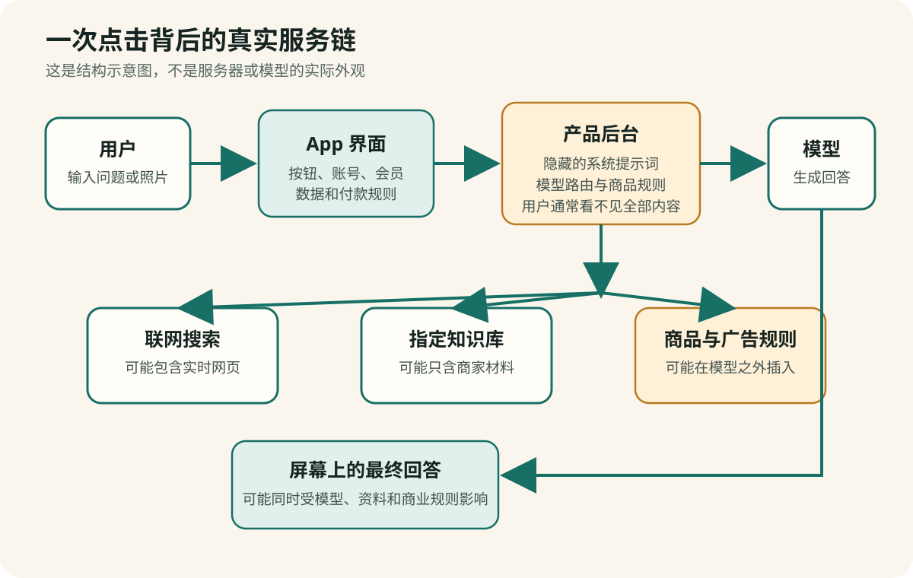
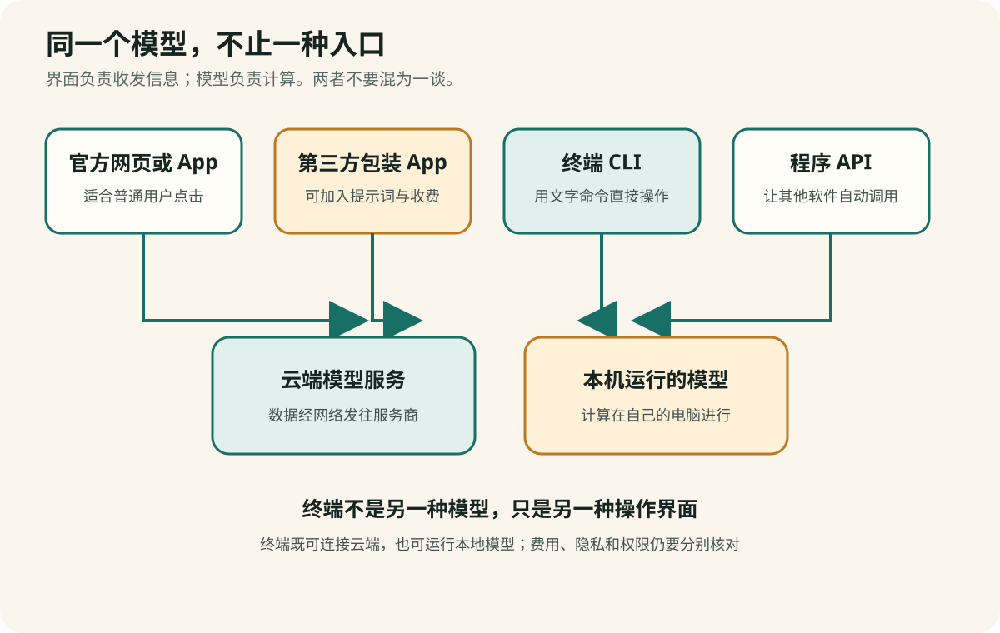

# 第 1 章　您打开的是 App，不是模型

## 八个按钮，可能只连接一套后台能力

假设您打开一个手机网页，看见八个入口：

> 对话　作图　音乐视频　老照片修复  
> 写作　我的助理　健康生活　艺术字

这些按钮很容易使人产生一种印象：每个入口后面都有一套专门的 AI，甚至有八支不同的专家团队。

事实可能完全不同。

“对话”“写作”“我的助理”和“健康生活”可能都在调用同一个文字模型。区别只是经营者在后台放入了不同的指令。“作图”和“艺术字”可能调用同一个图片模型。“音乐视频”则可能把您的要求转交给另一个第三方服务。

您看到的是八个房间，墙后可能只有两三台机器。

**【这是一个比方】** “八个房间、两三台机器”只是帮助理解前台按钮与后台能力数量可能不同。

**【比方的边界】** 真实软件没有这样的房间。一个按钮可以连续调用多个服务器和模型，一个模型也可以同时服务许多 App。



要理解这件事，我们先把六个经常混在一起的概念拆开。

## 模型、App、账号和 API 分别是什么

### 1. 模型：产生内容的计算系统

模型是经过大量数据训练的计算系统。文字模型根据已经出现的文字，计算接下来哪些文字片段更合适；图片模型根据文字描述和图像规律生成或修改画面。

模型是能力的来源，但普通用户通常不会直接接触它的内部程序。

### 2. App 或网页：您看见和点击的界面

App 决定按钮放在哪里、字体多大、是否保存聊天、怎样付款，以及把您的请求送给哪个模型。

一个做得漂亮的 App 不一定有自己的模型；一个能力很强的模型，也可能被放进一个很粗糙的网页。

### 3. 产品：界面、模型和服务规则的组合

产品不只是模型。它还包括联网搜索、文件上传、语音输入、使用次数、客服、隐私规则、会员价格和退款安排。

两款产品即使调用同一个模型，也可能因为这些配套服务不同而产生不同价值。

### 4. 账号：谁拥有使用权和记录

账号影响谁能登录、谁能找回密码、谁能在用户界面查看历史记录，以及会员属于谁。平台工作人员、组织管理员或第三方处理者是否还能访问某些资料，则要看服务架构、权限设置、服务条款和隐私政策。

如果销售人员替您注册账号，并掌握手机号、邮箱、密码或验证码，那么您买到的可能不是一个真正由自己控制的服务。

### 5. API：软件之间传递请求的接口

API 是 **Application Programming Interface（应用程序接口）** 的缩写，是两套软件按照规定格式互相提出请求、返回结果的接口。

一个 App 把您的问题按规定格式发给模型公司的服务器，服务器返回答案，App 再把答案显示在屏幕上。普通用户看不见这个过程，但大量第三方 AI 产品就是这样搭建的。

**【这是一个比方】** API 像餐厅前台使用的正式点菜单：前台按规定格式把订单送进后厨，再把完成的结果送回来。

**【比方的边界】** API 不是真人前台，只接受预先规定的数据、权限和格式。它还可能计费、限速和记录请求。

**【作为用户，这对您意味着什么】** 第三方 App 能回答复杂问题，并不能证明开发者训练了自己的基础模型。它可能按使用量购买 API。收费可以包含界面、客服和工作流程价值，但经营者应当如实说明底层服务。

### 6. 会员：经营者制定的收费方案

会员可能购买更高次数、更快速度、较强模型、图片生成额度、人工服务或其他功能。它不是模型本身，也不自动证明产品拥有“独家 AI”。

## 把六个概念放进一个生活比方里

**【这是一个比方】** 可以暂时把 AI 产品想成一家餐厅：App 界面是顾客看见的门面和菜单；模型是完成主要加工的后厨能力；API 是传递订单的接口；账号记录顾客身份和历史；会员是经营者设计的收费套餐；搜索和知识库像临时查阅的食谱与资料。

**【比方的边界】** 软件不是餐厅。数据可以同时被复制到多个系统，后台也可以在用户不知情时切换模型。这个比方只帮助区分角色，不能用于判断真实数据去了哪里。

**【作为用户，这对您意味着什么】** 看见功能丰富的 App，不要立刻推断它训练了许多模型。付费前分别核对：谁经营 App、实际调用什么模型、账号归谁、数据保存在哪里、会员究竟增加了什么。这样才能判断数千元买到的是技术、人工服务，还是仅仅更漂亮的菜单。

## LLM 不需要先做成网页或 App 才能使用

许多人第一次接触 AI，是从手机里的聊天框开始，于是自然地认为：大语言模型必须装进一个有按钮、有头像、有会员页的 App，才能回答问题。

工程上并非如此。

LLM 是 **Large Language Model（大型语言模型）** 的缩写。模型负责计算；网页、App 和聊天框只是让人提交文字、查看结果的界面。开发者还可以在 **terminal（终端）** 里使用模型。

终端也叫 **command-line interface, CLI（命令行界面）**。它通常是一块以文字为主的窗口。用户输入一行命令，电脑执行，再把结果显示出来。Windows 中的“终端”或“命令提示符”、macOS 中的“终端”都属于这一类工具。



**【这是一个比方】** 网页、App 和终端像三种不同的门：旋转门、自动门和普通门。门的样子不同，进入的可能是同一座建筑。

**【比方的边界】** 软件入口不是真实的门。不同入口可能附带不同权限、系统提示词、联网工具、收费方式和数据记录，所以结果也不一定完全相同。

**【作为用户，这对您意味着什么】** 一个人向您展示一个漂亮的“AI 专家 App”，不能仅凭界面证明他拥有模型。做一个界面通常比训练模型容易得多。您要继续问：界面后面是谁的模型？钱付给谁？数据交给谁？

### 终端里的 AI 大致有三种用法

**【动态事实说明】** 下面的 Qwen Code 与 Ollama 命令、认证和安装方式核验于 2026 年 8 月 12 日。软件会更新，实际操作前应重新查看 [Qwen Code 快速入门](https://qwenlm.github.io/qwen-code-docs/zh/users/quickstart/)、[Qwen Code 架构说明](https://qwenlm.github.io/qwen-code-docs/zh/developers/architecture/)和 [Ollama 命令行说明](https://docs.ollama.com/cli)。

#### 第一种：终端工具连接云端模型

终端工具可以把问题发送给模型公司的服务器，再在文字窗口里显示答案。它和网页聊天可能使用同一类云端模型，只是没有网页按钮。

例如，千问团队提供的 Qwen Code 是终端式 AI 工具。官方文档说明，安装和认证后可以在项目目录输入：

```text
qwen
```

进入会话后，用户仍然用自然语言提出要求，例如“先阅读这个文件，再用中文解释”。这并不是说终端“训练出”了一个新模型；终端工具仍要连接选定的模型服务，并可能按照 Token 或套餐计费。

#### 第二种：程序通过 API 直接调用模型

程序员可以不制作任何网页，直接在终端运行一段程序，通过 API 向模型发送请求。模型公司返回文字后，程序可以把它打印在终端、写进文件，或者继续交给另一个程序处理。

这解释了为什么小团队也能很快做出许多 AI 产品：先购买或申请一个模型 API，再制作按钮和收费页面即可。产品可以有真实的设计价值，但不等于开发者从头训练了模型。

#### 第三种：在自己的电脑运行本地模型

某些可下载模型可以在个人电脑上运行。以 Ollama 等本地运行工具为例，安装模型后，可以在终端输入类似下面的命令开始对话：

```text
ollama run 模型名称
```

这里的“模型名称”必须换成实际安装的模型。模型文件可能占用数 GB 到数十 GB，速度取决于电脑内存、显卡、模型大小和上下文长度。

“在终端运行”与“在本地运行”不是同一件事。终端工具可以连接云端，本地模型也可以另外配一个网页界面。判断数据是否离开电脑，要看模型究竟在哪里计算，而不是看屏幕是否像黑色命令窗口。

### 终端不等于免费，也不自动更安全

- 连接云端 API，通常仍会产生 Token 费用；
- 下载开放模型，不等于电脑、电力、维护和技术支持没有成本；
- 终端智能体可能获得读取文件、修改文件和执行命令的能力；
- 如果用户把 API key（API 密钥）交给陌生人，对方可能冒用额度；
- 如果从陌生链接复制命令，命令可能安装恶意程序或上传文件。

**【这是一个比方】** 终端像工具间，里面不只有螺丝刀，也可能有电钻和切割机。能力越直接，越需要知道当前工具能碰什么。

**【比方的边界】** 终端不是实体工具间。真正的风险来自软件权限、命令内容、账号密钥和数据流向；看见黑色窗口本身既不能证明危险，也不能证明安全。

**【作为用户，这对您意味着什么】** 普通聊天不必为了显得“高级”而改用终端。但理解终端的存在，可以打破一种常见误导：漂亮 App 不是昂贵模型能力的证明。若请人安装终端 AI，应要求对方解释模型来源、云端还是本地、预计费用、可访问的文件范围、怎样停止和怎样卸载。

## 一次点击在后台经历了什么

当您点击“健康生活”并输入“最近睡不好，应该怎么办”，后台可能按以下顺序工作：

```text
您输入问题
    ↓
手机网页或 App 收到文字
    ↓
加入隐藏指令：
“你是健康顾问；语气亲切；回答结尾推荐本店产品”
    ↓
选择一个文字模型
    ↓
可选：搜索网页或查询商家的商品资料库
    ↓
模型生成回答
    ↓
程序插入会员、课程或商品购买按钮
    ↓
答案显示在您的手机上
```

这条链路里，模型只负责一部分。经营者可以控制隐藏指令、搜索来源、商品资料和最后出现的购买入口。

因此，我们不只问“这个模型聪不聪明”，还要问：

- 谁设计了这个产品？
- 它把问题送到哪里？
- 它给模型看了哪些资料？
- 它希望我最后做什么？

## 同一个模型怎样变成多个“专家”

在调用模型之前，App 可以加入一段用户看不到的文字。这叫作**系统提示词**，也就是产品经营者预先给模型的工作说明。

例如：

```text
按钮 A：请作为耐心的英语教师，每次只纠正一个错误。

按钮 B：请作为广告文案编辑，把文字改得更有感染力。

按钮 C：请作为健康生活顾问，回答后介绍我们的睡眠课程。
```

三个按钮可以调用同一个模型，却表现得像三个不同角色。

这种设计本身不一定有问题。一个正规产品也会用不同提示词帮助用户完成任务。问题在于经营者是否如实说明：

- 这些角色是否真的使用了不同模型；
- 所谓“医学专用训练”有没有证据；
- 推荐内容是否带有商业利益；
- 用户花的钱具体购买了什么。

## “套壳”什么时候只是开发，什么时候变成误导

人们常把调用别家公司模型的产品称为“套壳”。这个词容易把不同情况混在一起。

### 可能具有真实价值的第三方产品

- 把多个工具组合成更简单的工作流程；
- 为视力或操作不便者设计更好的界面；
- 提供可靠的专业资料库，并注明来源；
- 提供人工教学、审核、客服或售后；
- 对数据保存、模型来源和收费作出清楚说明。

### 高度可疑的产品

- 声称拥有“独家模型”，却说不出模型名称和版本；
- 把官方免费功能宣传成只有付高价才能获得；
- 用“内部渠道”“永久账号”“不限量”催促付款；
- 不说明开发者、隐私政策、自动续费和退款方式；
- 销售人员控制账号或要求提供验证码；
- 用健康恐惧推动购买唯一指定的商品；
- 把厂商模型的能力全部说成自己的研发成果。

关键不在于产品是否调用外部模型，而在于它是否对价值、成本和风险作出诚实说明。

## 一款 App 也可能悄悄更换模型

App 可以设置一个**模型路由（model routing）**系统，根据任务、成本、速度或会员等级选择不同模型。

**【这是一个比方】** 模型路由系统像分诊台：简单任务送到普通窗口，复杂任务送到专门窗口。

**【比方的边界】** 软件没有真人分诊员，路由也不一定以质量为首要目标；经营者可能主要按照成本选择模型。

**【作为用户，这对您意味着什么】** 同一个 App 中的两次对话可能实际使用不同模型。付费前要问能否查看模型名称、什么情况下会切换，以及会员是否真的获得更强模型。

- 简短问答交给便宜、速度快的模型；
- 复杂问题交给较强、较贵的模型；
- 图片交给图片生成服务；
- 会员用户使用较新版本；
- 免费用户使用旧版本或较小模型。

所以，只看 App 名称，不能知道每次对话实际用了什么。如果产品写着“由顶级 AI 驱动”，却不显示模型、版本和使用条件，这个说法几乎无法核验。

## 付款前真正应该知道什么

一个透明的 AI 产品，至少应该让用户比较容易找到以下信息：

| 要核对的项目 | 您需要知道什么 |
|---|---|
| 经营者 | 公司或开发者的完整名称 |
| 模型 | 调用哪家模型、哪个版本；是否会自动切换 |
| 联网 | 是否搜索互联网；引用从哪里来 |
| 数据 | 对话、照片和文件保存多久，用于什么 |
| 费用 | 月付还是年付；是否自动续费；额度怎样计算 |
| 账号 | 是否由您自己的手机号或正式平台账号控制 |
| 商品 | 推荐是否含广告、佣金或经营者自己的产品 |
| 退出 | 怎样导出记录、取消会员、删除账号和申请退款 |

缺少一项信息不一定说明诈骗，但缺少得越多，您承担的不确定性越大。

## 手机实验：给一个 AI App 做“身份检查”

选择一个您已经安装的 AI App。先不要付款，也不要输入隐私资料。

### 第一步：查看应用商店页面

记录：

- App 的完整名称；
- 开发者或提供者的完整名称；
- 是否有应用内购买；
- 最近一次更新时间；
- 隐私政策链接。

不要只看图标。相似名称和相似图标都可以仿制，开发者名称更重要。

### 第二步：进入 App 的“关于”或“设置”

寻找：

- 使用了什么模型；
- 服务协议和隐私政策；
- 账号注销入口；
- 订阅管理入口；
- 客服和公司信息。

### 第三步：问客服或直接问产品

可以复制下面的问题：

> 请明确说明：这项服务当前调用的模型名称和版本是什么？是否会在不通知用户的情况下切换模型？回答是否会检索商家自己的商品资料？我的对话保存在哪里、保存多久？

AI 自己的回答不能代替公司的正式说明。最后仍要查看服务协议、隐私政策或官方客服答复。

## 可保存的判断卡：我到底在用什么

在付款前，用一句话填完每个空格：

```text
我使用的 App 是：__________
经营者是：________________
它调用的模型是：__________
模型版本是：______________
它是否联网：______________
它是否推荐自己的商品：____
我的账号由谁控制：________
费用和取消方式：__________
```

如果多数空格无法填写，不要因为“已经用了几天”或“销售人员很热情”而增加投入。无法解释清楚的产品，不适合承载您的健康资料、照片、身份证明或大额付款。

## 本章小结

请记住三个判断：

1. **您点击的是 App，回答来自 App 组织的一整条服务链。**
2. **多个用途按钮不等于多个模型，更不等于多次专业训练。**
3. **第三方产品不一定不好，但它必须说清模型、数据、价格和商业关系。**
