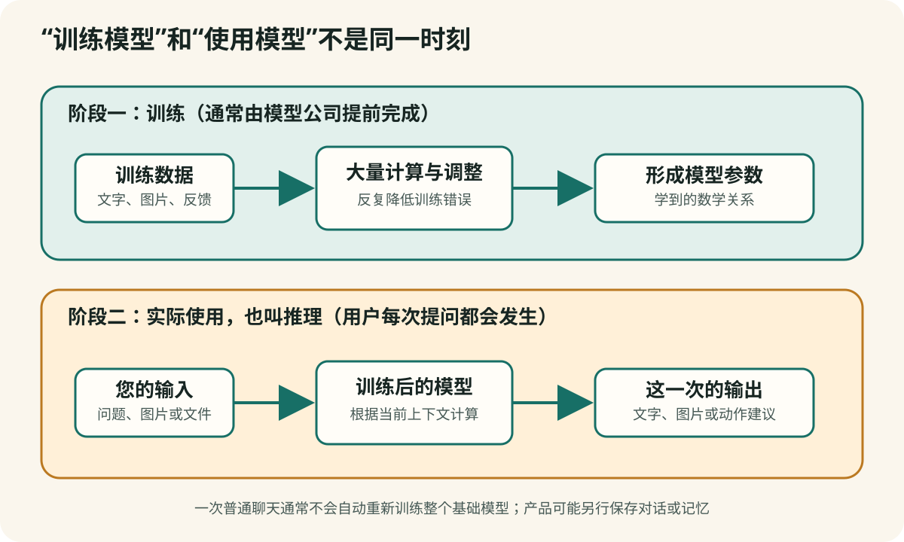

# 第 2 章　模型是怎样“学会”回答的

**【回看前文】** [第 1 章](#chapter-1)已经解释了模型、App、API、系统提示词和终端入口。本章只追问模型本身怎样训练，以及为什么训练完成后仍会说错；这些概念不再从头重复。

## 它不是在资料库里寻找一段现成答案

当 AI 在几秒钟内写出一封完整的信，人们很容易想象：它是不是从某个巨大的资料库里找出了一封相似的信，再复制给我？

这并不是大语言模型最主要的工作方式。

大语言模型在训练中阅读大量文字，从中学习语言和信息之间的统计关系。回答时，它根据您的问题和已经生成的内容，一步一步计算接下来出现什么文字片段更合适。

这些小片段叫作 **Token**。一个 Token 可能是一个汉字、一个词的一部分、一个标点或几个字符。模型生成一句话，实际上经历了许多次“下一片段应该是什么”的计算。

**【这是一个比方】** Token 有点像拼图块：一段文字先被拆成许多块，模型根据已经出现的块计算下一块。

**【比方的边界】** Token 不固定等于一个汉字或单词，不同模型拆分文字的方法也不同。模型生成文字的内部数学过程远比摆放普通拼图复杂。

**【作为用户，这对您意味着什么】** 很多模型接口按输入和输出 Token 收费。长文件、长对话和很长的回答都会增加用量；“一次聊天”不是一个固定成本单位。



这听起来似乎只是自动补全，为什么最后却能写文章、解释概念和解决问题？因为当训练规模足够大时，要持续预测合理的后文，模型必须学会许多隐藏结构：语法、概念关系、常见事实、文章格式、推理模式以及人们完成任务的方式。

但这里有一个非常重要的区别：

> 模型首先被训练成生成合适的后文，不是被直接训练成一台永远说真话的事实机器。

这既是它能力的来源，也是它会犯错的原因之一。

## 从训练到产品通常经历哪些阶段

不同公司使用的具体方法不完全相同。为了不把训练和产品上线混在一起，可以先看三个常见训练阶段，再看训练完成后的部署阶段。

### 第一阶段：预训练

模型阅读大规模文字、代码和其他形式的数据，反复练习预测缺失或接下来的内容。

在这个阶段，它逐渐学会：

- 语言怎样组织；
- 不同概念怎样共同出现；
- 问题和答案通常是什么关系；
- 文章、对话、表格和程序代码有哪些结构；
- 世界知识在公开资料中通常怎样被描述。

模型训练后形成大量**参数（parameter）**。参数是训练中调整出来的数字关系，共同影响模型怎样处理输入。

**【这是一个比方】** 参数可以暂时想成调音台上的许多旋钮：单个旋钮作用有限，许多旋钮一起决定最后的声音。预训练形成的能力，像大量规律被压缩进这些旋钮的组合。

**【比方的边界】** 参数不是可以逐个打开阅读的知识卡片，也不能简单说某个旋钮保存了某一个事实。模型更不是一排精确的百科全书条目。

**【作为用户，这对您意味着什么】** 厂商宣传参数数量时，可以把它看作模型规模信息之一，不能直接等同于正确率。数据质量、后训练、工具、速度和任务匹配同样重要。

### 第二阶段：指令训练

仅仅会继续写文字，还不等于会听懂“请比较”“请翻译”“请列出三种方案”这样的要求。

指令训练用大量任务示例，让模型学习怎样把人的要求转化为合适的回答形式。

**【这是一个比方】** 经过这一阶段，模型的使用感觉更像一个能够接受工作说明的助手，而不只是一个接着写文章的系统。

**【比方的边界】** 模型没有助手的职业责任和真实理解。它可能复述了要求，却仍然遗漏限制或生成错误事实。

### 第三阶段：偏好与安全训练

训练者会比较不同回答，告诉系统哪些更有帮助、更清楚、更安全。这些反馈可以来自人工，也可以由其他模型协助产生。

这一阶段会影响模型：

- 是否直接回答问题；
- 怎样承认不确定性；
- 遇到危险请求时怎样拒绝；
- 回答是简洁还是详细；
- 是否倾向于迎合提问者。

安全训练不是永久有效的真伪保证。它只能改变模型在某些情境下的行为倾向。

### 训练完成后的阶段：产品部署

部署（deployment）属于 AI 生命周期，但不是训练阶段。训练完成后，模型才会进入具体产品。产品经营者还能在模型之外加入：

- 系统提示词；
- 联网搜索；
- 专用知识库；
- 计算器、地图、日历等工具；
- 用户记忆；
- 商品规则和付费入口。

许多用户感受到的“AI 能力”，其实是模型与这些外部系统共同产生的。

**【作为用户，这对您意味着什么】** App 今天的回答方式发生变化，不一定是重新训练了整个模型。经营者可能只是更换系统提示词、搜索来源、知识库或安全规则。判断版本时，要分别问“模型变了没有”和“产品外层配置变了没有”。

## 数据污染：模型为什么可能把错误学进去

模型从数据中学习规律，因此训练资料的来源、质量和比例都会影响结果。这里用 **数据污染（data contamination / data pollution）** 作为一个便于普通读者理解的总称：本来希望模型学习的资料中，混入了错误、重复、过时、失去来源、比例失衡或不适合当前任务的内容。

这个总称下面还要区分几种不同问题。它们不能都叫“有人攻击了模型”。

### 第一种：资料本来就有错误或偏差

公开网页、论坛、广告、旧书、扫描文字和用户帖子都可能包含：

- 已经过时的政策、价格和医学说法；
- 互相复制的同一条错误信息；
- 广告伪装成经验或科普；
- OCR 识别错误、缺页和错误标签；
- 某些地区、年龄、语言或生活经验长期缺席；
- 只记录成功案例，没有记录失败与副作用。

模型不会自动知道每句话背后的作者、利益关系和证据质量。如果相似说法大量重复，它可能更容易学习到这种文字规律。

**【这是一个比方】** 可以把训练数据想成城市供水的上游。水源很多，但如果其中混入泥沙、旧管道锈迹或来源不明的排放，下游处理就必须识别和过滤。

**【比方的边界】** 数据不是水，错误信息也不会像泥沙一样自动沉底。训练团队可以清洗、去重、标注和评估数据，但无法用一个滤网保证所有事实永远正确。

### 第二种：有人故意进行数据投毒

**数据投毒（data poisoning）** 是更具体的安全概念：攻击者故意把精心设计的错误或触发样本放进训练数据、微调数据或其他学习来源，希望降低模型整体质量，操纵某类答案，或者留下只在特定条件下出现的后门行为。

美国国家标准与技术研究院的对抗性机器学习分类把 poisoning attack（投毒攻击）归为发生在训练阶段的攻击类型。中国《人工智能安全治理框架》也把数据投毒列为需要治理的风险。

普通网页里有一条错误，不一定就是数据投毒。要称为“投毒”，通常需要存在操纵意图或攻击设计。无意错误、低质量资料和故意投毒的责任性质不同。

### 第三种：AI 生成内容重新进入下一轮训练

网上越来越多文字、图片和评价由 AI 生成。如果后来的训练数据不加区分地大量吸收前一代模型生成的内容，错误、陈词滥调和少数模式可能被反复复制，原始资料中较少见的表达和事实逐渐消失。

研究者把递归使用模型生成数据后出现的退化过程称为 **model collapse（模型坍塌）**。2024 年发表于《自然》的研究在特定实验条件下发现，不加辨别地使用模型生成内容进行递归训练，会使原始数据分布中较少见的部分逐渐丢失。

这不表示“只要使用合成数据，模型一定会坏”。经过设计、筛选、验证，并与可靠的人类或真实世界数据结合的合成数据，也可以有训练价值。风险来自来源不清、比例失控和缺少质量控制，而不是“AI 生成”四个字本身。

**【这是一个比方】** 递归训练有点像不断复印上一张复印件，而不再保存原稿。经过许多轮后，浅色细节可能越来越淡。

**【比方的边界】** 模型训练不是复印机。研究结果取决于数据比例、筛选方法、任务和训练设计；保留高质量原始数据、正确使用合成数据和进行评估，都可能改变结果。

### 第四种：模型没有被重新训练，但搜索或知识库被污染

第 1 章已经说明，产品可以在模型之外连接搜索、RAG 知识库和用户记忆。如果这些外部资料被加入虚假文档、广告、过期制度或恶意指令，模型也可能在当前回答中引用错误内容。

这种 **知识库污染（knowledge-base poisoning）** 或检索污染，不一定改变基础模型参数。它更像在回答前把一份有问题的材料放到模型面前。安全研究已经展示，攻击者可以设计容易被检索到的段落，使 RAG 系统朝指定错误答案偏移。

因此要分清：

| 污染发生在哪里 | 会影响什么 | 用户应该追问什么 |
|---|---|---|
| 基础训练数据 | 模型长期形成的广泛规律 | 数据来源、清洗、评估和版本 |
| 微调数据 | 特定格式、任务或倾向 | 微调目标、样本来源和对照测试 |
| 搜索或 RAG 知识库 | 当前回答引用的外部资料 | 资料由谁加入、能否打开原文、多久更新 |
| 当前对话和文件 | 这一次任务的上下文 | 是否混入陌生指令、错误附件或隐私资料 |

### 数据清洗能降低风险，但不能提供永久保证

模型开发者会使用过滤、去重、来源控制、人工标注、异常检测、红队测试和训练后评估等办法降低污染。RAG 产品还可以限制谁能写入知识库、记录文件版本、审核来源，并在高风险回答中要求多来源核验。

这些措施都有价值，但“我们清洗过数据”仍然不是永远正确的证明。数据规模巨大，事实会变化，攻击方法也会变化。

**【作为用户，这对您意味着什么】** 当 AI 给出一个流畅且多数网页都在重复的答案时，不要把“重复很多次”直接当成独立证据。重要结论要追到最早来源，检查日期、作者和利益关系。产品声称使用“专业知识库”时，要问谁能加入资料、是否保留版本、能否显示原文，以及怎样删除错误资料。

还要注意：您的一次普通对话不一定会立刻重新训练基础模型。是否用于训练、人工审查或产品改进，要看具体服务的隐私政策和账号设置，不能由“AI 会学习”四个字推断。

### 本节技术资料

- [中国《人工智能安全治理框架》2.0版发布说明](https://www.cac.gov.cn/2025-09/15/c_1759653448369123.htm?type=h5)
- [NIST：对抗性机器学习攻击与缓解分类](https://csrc.nist.gov/pubs/ai/100/2/e2025/final)
- [《自然》：递归使用模型生成数据时的模型坍塌研究](https://www.nature.com/articles/s41586-024-07566-y)
- [PMLR：RAG 知识源投毒与检测研究](https://proceedings.mlr.press/v318/moradi26a.html)

## 训练、微调、知识库和提示词不是一回事

商业宣传经常把所有定制都称为“训练”。技术上，这几种方法有明显区别。

### 提示词：给现有模型一份工作说明

例如：

> 你是一位耐心的英语教师。不要立即给答案，先指出一个线索。

模型本身没有改变。下一次换一段说明，它就可以扮演别的角色。成本低、速度快，也是大量“专属专家”的真正来源。

### 规则：程序直接决定什么时候显示什么

例如，只要用户提到“睡不好”，程序就在回答后显示睡眠课程链接。这甚至不需要模型作出商品判断。

### RAG：先查外部资料，再让模型回答

RAG 是 **Retrieval-Augmented Generation** 的缩写，中文常译为“检索增强生成”。它的基本过程是：

```text
用户问题
   ↓
从指定文件或网页中查找相关片段
   ↓
把找到的片段和问题一起交给模型
   ↓
模型根据这些片段组织回答
```

正规用途包括：让 AI 根据单位制度、产品说明书或课程材料回答，并给出出处。

但如果知识库里只有某家商店提供的宣传材料，回答也会受到这些材料的限制。RAG 能让回答“依据资料”，却不能自动保证资料本身公正、完整或真实。

### 微调：用示例继续训练权重或适配参数

微调会用一批特定示例继续训练现有模型，使它更稳定地遵循某种格式、语气或任务模式。不同方法更新的范围不同：全量微调可能更新全部或大部分基础权重；LoRA 等参数高效方法可以冻结基础权重，增加并训练较小的适配参数。

微调可能有价值，但它不是魔法：

- 数据质量差，模型会学到错误；
- 示例带有销售偏见，模型可能更稳定地重复偏见；
- 微调不等于获得实时知识；
- 微调不自动产生专业资格；
- 经营者声称“微调过”，应说明数据范围、评估方法和适用边界。

## 为什么商家不必微调，也能让 AI 反复推荐商品

假设一个健康页面不断推荐某种中药或保健品，至少有五种可能：

1. 隐藏提示词要求它优先介绍该商品；
2. 搜索范围被限制在商家自己的页面；
3. RAG 知识库主要由产品宣传材料组成；
4. 程序规则检测关键词后插入广告；
5. 模型确实经过带有相关倾向的微调。

前四种通常比真正微调更容易、更便宜。因此，只根据回答风格，无法判断模型是否接受过专门训练。

您真正应该问的是：

- 推荐依据来自哪些资料？
- 是否存在商业关系或佣金？
- 有没有同样认真地说明不使用该商品的理由？
- 有没有列出风险、禁忌和证据不足之处？
- 能否提供独立于销售方的原始来源？

## 模型为什么会不准确

### 1. 它学到的是资料中的规律，也会继承资料的问题

训练资料可能包含错误、过时内容、互相矛盾的观点和社会偏见。规模巨大不等于每一部分都经过事实审查。

### 2. 它把知识压缩在参数关系中

模型不是逐条精确保存所有细节。常见模式可能记得较好，罕见姓名、日期、数字和出处更容易混淆。

### 3. 生成流畅回答比承认缺少证据更符合基础训练目标

如果一个问题看起来应该有答案，模型可能生成形式上最像答案的内容，即使缺乏可靠依据。这类看似合理却不真实的内容常被称为“幻觉”。

### 4. 问题可能含糊或带有错误前提

例如：“某位专家已经证明这种药有效，他用的是什么方法？”如果所谓证明并不存在，模型仍可能顺着提问的前提继续回答。

### 5. 模型可能过度迎合

当用户反复暗示自己想要某个结论时，部分模型会倾向于同意，而不是坚持指出证据不足。

### 6. 联网和工具也会出错

搜索可能找到低质量网页；网页可能已经过期；系统可能只读取摘要；引用可能和结论不匹配。使用了工具不等于工具结果被正确理解。

## “它听起来很确定”不能作为证据

人类说话时，语气通常反映一定程度的信心。模型的语气则是生成风格的一部分。

它可以用犹豫的语气说出正确事实，也可以用非常确定的口气说出错误日期。粗体、编号、术语和完整引用格式都只能证明回答被组织得很好，不能证明内容已经核实。

判断一条回答，应把“表达质量”和“证据质量”分开：

| 表达质量 | 证据质量 |
|---|---|
| 是否清楚、易懂、有结构 | 是否有原始来源和日期 |
| 是否符合要求的语气 | 来源是否真正支持结论 |
| 是否给出具体步骤 | 是否说明不确定性和反例 |
| 是否看起来专业 | 是否经得起独立来源核验 |

## 手机实验：改变一个条件，看模型是否真的理解限制

选择任意一个 AI，依次提出下面三个问题：

### 问题一

> 请介绍三种改善睡眠的日常方法。

### 问题二

> 请介绍三种改善睡眠的日常方法。不要推荐任何药物、保健品、课程或付费产品。

### 问题三

> 请把建议分成“有较强证据”“证据有限”和“只适合向医生询问”三类，并说明你无法知道我的哪些个人情况。

比较三个回答：

- 限制条件是否被遵守？
- 回答是否主动推销？
- 它是否承认不了解您的病史和用药？
- 它所谓“证据”有没有可核验来源？
- 如果重新提问一次，结论是否稳定？

这个实验不是为了让 AI 给您治疗方案，而是观察它怎样响应指令、边界和证据要求。

## 可保存的判断卡：它为什么这样回答

当一条 AI 回答影响您的购买或重要决定时，依次问：

```text
这是模型原有的一般能力，还是产品加的指令？
它有没有搜索互联网？
它搜索的是整个网络，还是指定知识库？
回答里是否插入了固定商品规则？
所谓“专门训练”有什么可以核验的证据？
结论来自独立资料，还是销售方自己的资料？
如果回答错了，损失会有多大？
```

## 本章小结

1. **大语言模型通过预测文字片段学习语言和知识结构，不是逐条查询一部完美百科全书。**
2. **预训练、指令训练和偏好安全训练属于训练过程；产品部署是训练完成后的生命周期阶段。**
3. **提示词、程序规则、RAG 和微调都能改变回答，但只有微调继续进行训练，并更新权重或新增可训练适配参数。**
4. **流畅、专业和确定的语气不能代替证据。**
5. **当回答推动购买时，要检查资料来源和经营者的利益关系。**

下一章会集中讨论一个最容易误解的问题：既然模型知道那么多，为什么它仍会“像真的一样”编造事实，以及我们怎样根据错误代价决定核验强度。
