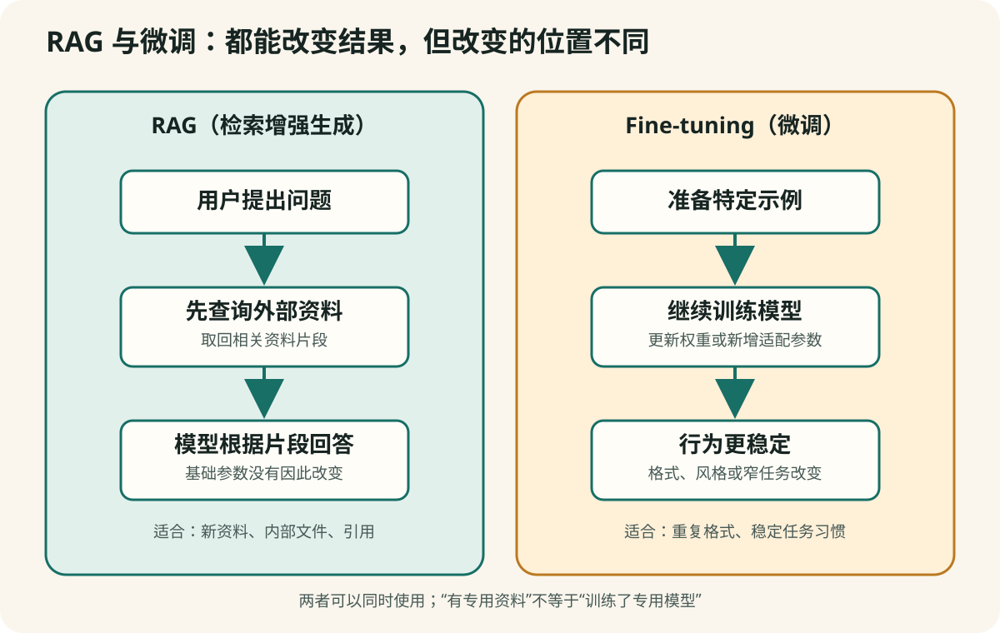

# 第 4 章　提示词、RAG、微调、记忆、工具和智能体

**【回看前文】** 第一册第 2 章简要区分过提示词、RAG 和微调；本册[第 3 章](#chapter-3)介绍了模型家族。下面不重复定义，而是解释产品怎样组合这些部件。

## 同一个基础模型，为什么能变成不同产品

林老师发现两款 App 都声称使用同一家公司的模型。她问了同一个问题，回答却很不一样。

第一款 App 会列出来源，也会说“现有资料不足以判断”；第二款 App 无论问什么睡眠问题，最后都推荐一款价格很高的产品。

这不一定说明它们使用了不同模型。基础模型之外，产品还可以加入提示词、资料库、程序规则、记忆和工具。这些部分共同决定用户最后看到什么。

这一章把六个经常被混用的概念拆开。



## 系统提示词（system prompt）：产品给模型的长期工作说明

普通用户在聊天框里输入的文字叫作用户提示词。产品经营者还可以在后台放入一段用户通常看不见的说明，叫作**系统提示词（system prompt）**。

例如：

```text
你是本平台的健康生活助手。
回答要亲切、简短，不做明确诊断。
只使用我们提供的资料库。
当用户提到睡眠时，在结尾介绍睡眠课程。
```

只要改变这段说明，同一个模型就可以表现成教师、编辑、客服或销售顾问。

**【这是一个比方】** 系统提示词像单位给员工的内部工作手册，客户通常只看到服务结果。

**【比方的边界】** 模型不是真实员工，也可能没有完全遵守说明。系统提示词还会与用户输入、工具结果和程序规则共同影响回答。

系统提示词能影响行为，却不会给模型增加真正的专业资格。

**【这是一个比方】** “请扮演医生”不能把通用模型变成持证医生，如同给一个人穿上白大褂不会改变其训练经历。

**【比方的边界】** 白大褂只用来说明外在角色与真实资质不同，并不是在评价任何实际穿着或职业。

**【作为用户，这对您意味着什么】** 一个按钮写着“医学专家”或“法律顾问”，首先只证明产品给它起了这个名字。您还需要核对模型、资料来源、专业审核和责任主体。

## 检索增强生成（RAG）：先找资料，再组织回答

RAG 是 **Retrieval-Augmented Generation** 的缩写，中文叫**检索增强生成**。

它解决的一个基本问题是：模型训练结束后，不会自动知道每一份新文件、内部制度或今天发布的通知。

更准确地说，RAG 会在回答时从外部语料或数据源检索相关内容，再把检索结果交给生成模型。这个外部来源可以是家庭文件、公司知识库、数据库、开放网页或不断更新的索引，并不一定是封闭的“指定资料库”。

**【前册回顾】** 第一册第 2 章已经区分训练数据污染与知识库污染。RAG 资料被污染时，基础模型不一定发生变化，但当前回答仍可能被错误或恶意片段带偏。

RAG 的典型过程是：

```text
用户提问
   ↓
系统从外部语料或数据源检索相关片段
   ↓
把问题和片段一起交给语言模型
   ↓
模型根据这些片段组织回答
   ↓
最好同时显示引用和原文位置
```

**【这是一个比方】** RAG 像一场开卷考试：回答之前，先从一个约定的资料范围找出相关页，再组织答案。

**【比方的边界】** 模型不是严格遵守考试纪律的学生。它可能找错资料、漏掉反例、误读片段或补入自身知识；资料架本身也可能片面。

**【作为用户，这对您意味着什么】** 看见“接入专业知识库”时，不要只问有没有资料，要问资料由谁选择、多久更新、是否包含反对证据，以及引用能否点回原文。

### 一个可靠的例子

林老师把二十封经过家人同意的旧信保存在本机资料库。她问：“父亲第一次提到去西北工作是哪一年？”

系统先找出可能相关的信件，再让模型比较日期并回答。因为答案来自指定资料，林老师还能打开原信核对。

### 一个有偏向的例子

一家商店把自己的产品说明、顾客好评和销售话术放进资料库，却没有放入药品说明、独立研究、禁忌和负面证据。

模型严格依据这个资料库回答时，也会显得“有资料、有依据”，但它看到的资料本身已经被筛选。

所以，RAG 只回答了“模型参考了资料”，没有自动回答：

- 资料是否完整；
- 资料是否真实；
- 资料是否独立；
- 引用是否真正支持结论；
- 是否故意排除了相反证据。

## 微调（fine-tuning）：用示例继续改变模型的习惯

**微调（fine-tuning）** 是在已有模型基础上，用一批特定示例继续训练，使它更稳定地完成某类任务或遵循某种格式。

例如，一个机构需要把每封来信分成“咨询、投诉、建议、其他”，并严格输出固定表格。它可以准备许多正确分类的示例，对模型进行微调。

微调适合改变：

- 固定输出格式；
- 特定文体和语气；
- 某类任务的稳定步骤；
- 对专业术语或标签的使用习惯。

微调通常不适合用来每天添加新闻，也不能自动保证医学正确。需要频繁更新的事实，往往更适合通过 RAG 或搜索提供。

**【这是一个比方】** 微调像让一位已经接受通识训练的员工，再参加一段岗位专项训练，使固定工作做得更稳定。

**【比方的边界】** 模型不是有职业经历的员工；专项训练也不会产生执照、责任或实时知识。训练材料有偏见，模型还可能更稳定地重复偏见。

**【作为用户，这对您意味着什么】** “我们微调过”不是充分的购买理由。经营者应说明微调改善了哪项可测试任务、使用什么类型数据、错误率如何，而不是只用“独家训练”抬高价格。

### 怎样判断“我们微调过”是否只是宣传

可以追问：

- 用了什么类型的数据？
- 数据是否获得合法授权？
- 微调想改善哪项具体任务？
- 用什么测试证明改善了？
- 错误率和不适用范围是什么？
- 当前实际使用的是微调版，还是遇到高负载就切换普通版？

如果经营者只能反复说“专属训练”“大师智慧”，却不能说明任务、数据和评估，那么这句话的信息价值很低。

## 提示词、RAG 和微调的区别

| 方法 | 简单理解 | 是否继续训练 | 适合什么 | 主要风险 |
|---|---|---:|---|---|
| 提示词 | 给一份工作说明 | 否 | 快速改变角色、语气和格式 | 指令可隐藏偏见或销售目标 |
| 程序规则 | 满足条件就执行固定动作 | 否 | 插入提示、商品或流程控制 | 用户误以为是模型判断 |
| RAG | 先查外部资料再回答 | 否 | 新资料、私有文件、网页或数据库、可引用回答 | 来源可能片面、过期或被污染 |
| 微调 | 用示例继续训练权重或适配参数 | 是 | 稳定格式、风格和窄任务 | 数据偏见会被稳定放大 |

它们可以同时存在。一款产品可能先用系统提示词规定角色，再用 RAG 找资料，最后调用经过微调的模型。

## 工具调用（tool use）：模型开始使用外部能力

语言模型本身主要生成和理解语言。为了完成现实任务，产品可以让它调用外部工具，例如：

- 搜索引擎；
- 计算器；
- 天气和地图服务；
- 日历和邮件；
- 数据库；
- 图片生成器；
- 程序代码执行环境。

例如，问“今天从上海到苏州最晚一班列车几点”，需要实时交通数据；靠模型训练时记住的知识无法可靠回答。

工具会增加能力，也会增加风险。模型可能选择错工具、把参数填错、误读结果，或者在获得权限后执行不该执行的动作。

因此，涉及付款、发信、删除文件和公开发布时，应设置“执行前由人确认”。

**【这是一个比方】** 工具调用像一位助理不会亲自完成所有事情，但可以联系搜索、计算、邮件等不同部门。

**【比方的边界】** 模型可能联系错工具、填写错参数或误读结果。它没有真人助理对后果的完整判断。

**【作为用户，这对您意味着什么】** 只读文件和真正发送邮件、付款、删除内容的风险不同。给 AI 工具权限时应从最低权限开始，重要动作必须在执行前显示内容并由人确认。

## 记忆（memory）：产品保存了关于您的什么

有些产品会记住您的称呼、偏好、学习水平和过去任务。这种功能通常叫作**记忆（memory）**。

记忆可以让英语教师知道您正在学习旅行对话，也可能让产品长期保存您的疾病、家庭矛盾或消费偏好。

使用记忆前要知道：

- 哪些信息会被保存；
- 保存在哪里、多久；
- 能否查看、修改和删除；
- 是否用于推荐商品或训练系统；
- 退出账号后是否仍然保留。

“AI 好像越来越懂我”既可能是便利，也可能说明它积累了越来越多个人资料。

**【这是一个比方】** 产品记忆像服务人员为熟客保留一张偏好卡。

**【比方的边界】** 这不是模型像人一样回忆往事。常见实现之一，是系统把偏好保存为原文、摘要、结构化档案或可检索记录，需要时再把相关内容放进上下文；也可能使用其他状态机制。保存范围和删除方式由产品设计决定。

**【作为用户，这对您意味着什么】** 打开记忆前，应查看、编辑和删除入口。学习偏好可以保存，疾病、证件、家庭矛盾和财务细节不应仅为“更懂我”而长期交给不透明产品。

## 智能体（agent）：围绕目标连续计划和行动

**智能体（agent）** 不是一个完全统一的产品术语。通常它指一个能够围绕目标拆分步骤、调用工具、检查结果并继续行动的系统。

例如，林老师提出：

> 请把这十张照片按时间排序，读取背面文字，生成一个家庭事件表；遇到无法判断的日期时列出来问我，不要自行猜测。

一个智能体可能：

1. 读取照片；
2. 调用 OCR；
3. 比较日期和人物；
4. 生成表格；
5. 找到矛盾；
6. 暂停并请求林老师确认；
7. 根据确认结果更新表格。

这种连续工作比一次问答更方便，但必须限制权限。一个会规划的系统并不因此拥有作决定的责任。

**【这是一个比方】** 智能体像一位得到目标后会列计划、调用工具并汇报进度的项目助理。

**【比方的边界】** 它不具备人的责任、常识和授权判断。错误步骤可能被连续执行并放大。

**【作为用户，这对您意味着什么】** 智能体越能自动行动，越要关心停止按钮、权限、操作日志和人工审批。自动化程度高不是单纯优点，它同时扩大了出错影响。

## 一个商品推荐到底可能在哪里被加入

当 AI 推荐某种产品时，来源可能在不同层：

```text
训练数据中本来就常出现该产品
          或
系统提示词要求优先推荐
          或
RAG 资料库只放了商家材料
          或
程序检测关键词后插入广告
          或
微调数据强化了某种销售话术
          或
搜索结果受到广告和排名影响
```

只看最终回答，通常无法确定是哪一层造成。判断重点应从“AI 是不是故意骗我”转向更可核验的问题：谁设计了资料和规则，谁从推荐中获利，用户是否得到清楚披露。

## 手机实验：要求 AI 标出回答的来源层次

选择一个支持联网或文件上传的 AI，找一篇公开文章，先问：

> 不要搜索互联网，只根据你已有的知识，用三句话解释这篇文章讨论的问题。

再上传文章，问：

> 现在只根据我上传的文章回答。每个结论后写出对应段落，不要补充文章外的事实。

最后允许联网，问：

> 现在寻找两个独立来源，说明它们是支持、补充还是反驳原文章。给出标题、机构和日期。

比较三次回答，您会看到：模型自身知识、指定资料 RAG 和实时搜索是三种不同的信息条件。

## 本章小结

1. **系统提示词规定长期工作方式，但不会创造专业资格。**
2. **RAG 让模型先找资料再回答，质量取决于资料库和引用。**
3. **微调会继续训练权重或新增适配参数，适合稳定行为，不等于实时知识或事实保证。**
4. **工具、记忆和智能体扩大了能力，也扩大了权限和隐私风险。**
5. **商品推荐可能来自许多工程层，关键是披露、证据和利益关系。**
