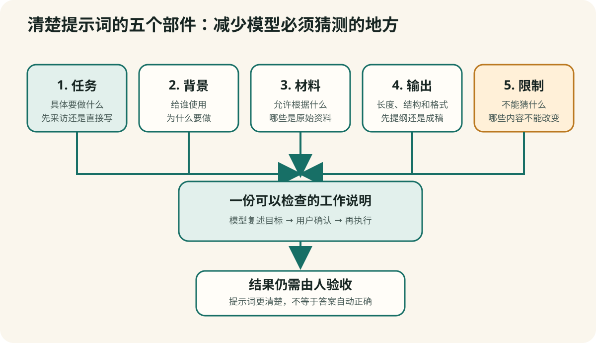
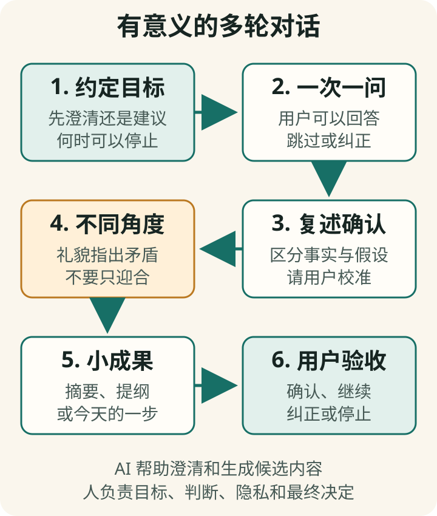

# 第 6 章　提示词工程：不是咒语，而是减少猜测


**【前册回顾】** 第一册已经解释提示词和系统提示词的区别，第二册第 4 章又说明提示词不能代替 RAG 或微调。本章不再讨论后台工程，而是专门练习普通用户怎样把任务说清楚。

## “提示词工程”这个名字容易把事情说得太神秘

您在聊天框里输入或说出的要求，叫作**提示词（prompt）**。设计、测试和改进这些要求的方法，叫作**提示词工程（prompt engineering）**。

“工程”并不意味着一定要写程序。它强调的是：把目标说清楚，观察结果，发现问题，修改一个条件，再测试一次。

**【这是一个比方】** 提示词工程像给一位新同事准备工作说明。如果只说“帮我写一下”，对方必须猜文章写给谁、用什么语气、哪些事实不能改、需要多长、什么时候交。

**【比方的边界】** 模型不是真实同事，不会自动拥有共同生活背景、责任感和澄清习惯。提示词再清楚，也不能给模型增加它没有的知识、工具或专业资格。

**【作为用户，这对您意味着什么】** 学习提示词工程不是为了购买所谓“内部咒语”，而是减少模型猜测、让错误更容易发现，并把自己已经知道的条件保留在任务中。

提示词工程的核心，不是寻找一句万能咒语，而是**减少模型不得不猜测的地方**。



## 提示词的实用窍门：先把五件事说完整

提示词确实有一些实用窍门，但它们不是需要背诵的固定句式。最有用的基本方法，是检查五个部件：

```text
1. 任务：要做什么？
2. 背景：为什么做、给谁用？
3. 材料：允许根据什么内容？
4. 输出：希望得到什么形式？
5. 限制：哪些事情不能做？
```

可以记成一句话：

> 做什么，给谁用，根据什么，交成什么样，哪些不能做。

## 从一句模糊要求，变成一份可执行说明

林老师先输入：

> 帮我写一篇文章。

模型只能猜。它可能写成一篇空泛的抒情散文，还可能添加林老师从未说过的经历。

加入五个部件后：

> **任务：** 请把我的口述整理成一篇家庭回忆短文。  
> **背景：** 读者是家中十五岁以上的晚辈，他们不了解外祖父年轻时的生活。  
> **材料：** 只能使用我下面提供的口述和照片背面的日期。  
> **输出：** 先列提纲，再写 800—1000 字初稿；语气平实，不煽情。  
> **限制：** 不要猜测人物心理，不要补写我没有提供的地点或对话。资料不足处用【待确认】标出。

这个版本不保证一次完美，但大幅减少了模型自由编造的空间。

## 技巧一：任务复杂时，先让 AI 提问

如果自己也不确定条件是否完整，可以说：

> 我想把十几张家庭照片整理成一篇文章。先不要写。请先问我最多八个必要问题，帮助你了解读者、时间范围、人物关系、证据和我希望保留的语气。一次问一个问题。

“先不要执行”很重要。否则模型可能一边提问，一边已经开始写结论。

这种方法适合：

- 写个人经历；
- 制订学习计划；
- 比较购买方案；
- 设计图片；
- 制作小程序。

## 技巧二：把材料和指令分开

如果要模型修改一段文字，可以明确标记：

```text
【任务】
只检查错别字和不通顺处，不改变事实和语气。

【原文开始】
……我的原文……
【原文结束】

【输出】
先给修改版，再逐条解释修改原因。
```

这样能减少模型把原文中的一句话误当作新指令。

## 技巧三：规定模型不知道时应该怎样做

不要只说“不要编造”。还要告诉它遇到缺失资料时输出什么：

> 如果材料中找不到答案，请写“材料中未找到”，并告诉我还需要哪项信息。不要根据常识补全姓名、日期和地点。

明确的替代动作比单纯禁止更容易执行。

## 技巧四：要求区分事实、推断和建议

面对信息问题，可以要求三栏输出：

| 类别 | 含义 |
|---|---|
| 资料直接支持的事实 | 能指出原文或来源 |
| 根据资料作出的推断 | 有理由，但不是原文直接结论 |
| 建议或下一步 | 可供考虑，不是已经发生的事实 |

可复制的提示词：

> 请把回答分成“材料直接支持”“模型推断”“待人工核验”三部分。每项“材料直接支持”附来源和日期。只有我实际打开来源并确认它支持该结论后，才可以由我标为“已核实”。不要因为多个网页互相转载，就把它们当作多个独立来源。

## 技巧五：一次只修改一个重要变量

如果图片不满意，不要同时要求“换人物、换背景、换颜色、换角度、变成水彩、再加文字”。模型可能重新生成整张图，您无法判断哪条修改造成了变化。

更稳妥的方法是：

1. 先确定构图；
2. 再调整人物动作；
3. 再调整光线和色彩；
4. 最后处理文字和细节。

写作也是一样：先确认事实和结构，再改语气，最后校对字词。

## 技巧六：给例子，但说明例子哪些地方重要

只说“照这个写”可能让模型模仿不必要的细节。应说明：

> 下面的范文只用于参考段落节奏和朴素语气，不要复制其中的人物、事件、句子和比喻。

例子能比抽象说明更精确，但也可能把例子中的偏见和错误带入结果。

## 技巧七：让模型先交计划，再交成品

复杂任务适合分阶段：

```text
第一步：复述你理解的目标和限制。
第二步：列出工作计划和需要我确认的问题。
第三步：我确认后再执行。
第四步：提交结果时附自检清单。
```

这让人有机会在模型做大量工作之前纠正方向。

## 有意义的对话不是“一次把话说完”

提示词工程常被误解成写一段很长、很专业的命令。真实生活里，许多好任务一开始并没有完整答案。您可能只知道自己想聊什么，却还不知道真正的问题在哪里。

这时可以把提示词设计成一套**对话规则**，让 AI 先听、再问、再复述，而不是立即下结论。



可以复制下面这段开场白：

```text
我想认真讨论一个问题，但现在还没有想清楚。
请先不要给结论，也不要连续列出很多建议。

请按以下方式和我谈：
1. 一次只问一个问题；
2. 每问三次，用两三句话复述你目前对我的理解；
3. 区分我说的事实、感受、假设和愿望；
4. 如果你发现矛盾，礼貌指出，不要一味赞同；
5. 在我说“请给建议”以前，只帮助我澄清；
6. 不知道的地方直接问，不要替我编理由。

我想讨论的是：退休以后，我想继续学习，
但总是开始几天就停下来。
请从第一个问题开始。
```

这段提示词的重点不是“退休学习”，而是约定对话怎样进行。主题可以换成家庭沟通、旅行计划、阅读一本难书、准备一次发言，或者回顾一段人生经历。

### 一段多轮对话可能怎样展开

下面不是要求 AI 背诵的固定台词，而是一段示范：

> **AI：** 您最想继续学习的是什么？先只选一件。  
> **林老师：** 我想重新学英语，至少出国旅行时敢开口。  
> **AI：** 您过去停止学习，通常发生在什么时候？  
> **林老师：** 前几天很积极，后来教材越来越难，我觉得一天漏掉就跟不上了。  
> **AI：** 我先复述一下：目标不是考试高分，而是旅行时能开口；困难也不只是时间少，而是计划一旦中断，您就觉得整套计划失败了。这个理解准确吗？  
> **林老师：** 对。  
> **AI：** 如果把成功标准改成“每周完成三次十分钟对话”，而不是“每天必须学”，您觉得最难的部分会是什么？

这里，AI 没有在第一轮就列“十大英语学习方法”，而是逐渐把“缺乏毅力”拆成目标、节奏和失败标准三个具体问题。用户也可以随时说：“你理解错了”“这个问题太私人”“先停在这里”。

**【这是一个比方】** 这种对话像把一团缠在一起的毛线慢慢理开：先找到一根线头，再处理下一个结。

**【比方的边界】** 人的经验不是毛线，AI 也不是心理咨询师。它的复述可能遗漏重要背景，提出的不同角度也可能不合适。

**【作为用户，这对您意味着什么】** 有意义不等于谈得久，更不等于把隐私全部交出去。好对话应让问题变得更清楚，并在适当位置形成一个可检查的小成果；如果只是不断赞美、重复或诱导披露更多私事，可以停止。

## 五种比“直接给答案”更有用的对话要求

### 1. 请先复述，看是否真正听懂

> 在回答以前，请先用三句话复述你理解的目标、已经知道的事实和仍缺少的信息。等我确认后再继续。

### 2. 请提出一个不同意见

> 不要为了让我高兴而同意我。请指出我这个想法最可能忽略的一项代价，并问我是否愿意调整条件。

### 3. 请一次只推进一小步

> 不要一次给完整方案。先帮我选出今天十分钟内可以完成的第一步；完成后我再回来继续。

### 4. 请用“我来讲给你听”检查理解

> 先向我解释这个概念，然后请我用自己的话讲回来。根据我的复述，只指出最重要的一处误解，不要重新讲一遍全部内容。

### 5. 请在结束时留下可继续的记录

> 对话结束时只记录：已经确认的目标、我做出的决定、仍未解决的问题和下一步。不要记录我的私人故事细节。

这些要求把 AI 从“一次性答案机”变成可以控制节奏的对话工具。它们同样适用于教学、写作采访、设计图片和公司内容策划。

## 什么时候应该重新开一个对话

同一个聊天窗口越来越长时，旧要求、旧材料和新目标可能混在一起。遇到下面情况，可以新开对话：

- 原来的任务已经结束；
- 讨论对象从个人文章变成公司宣传；
- 您不希望旧材料继续影响新一轮回答；
- AI 持续重复已经纠正过的误解；
- 您希望用一份干净的摘要重新开始。

新开前，可以要求 AI 生成一份不含隐私的“交接卡”：目标、已确认事实、限制、待办。用户检查后，再把需要的部分放入新对话。

**【重要的隐私区别】** 新开对话只是在使用层面减少旧材料继续进入新一轮上下文，**不等于删除旧资料**。如果原对话或附件含有不应保留的隐私，应另外删除原对话和附件，检查并清理产品记忆，查看是否允许关闭模型改进或训练用途，并核对服务的后台留存期限和删除政策。不同产品的删除效果不同，不能只看聊天列表里是否消失。

## 五类任务的提示词有什么不同

### 聊天和教学

重点是角色、难度、轮次和纠错方式：

> 请做我的英语对话教练。我的水平大约是大学英语四级，但多年没有开口。我们模拟酒店入住。每轮你只说一到两句，等我回答；每次只纠正一个最影响理解的错误。先用英语提示，如果我仍不懂再用中文解释。

### 写作

重点是读者、材料边界、结构和声音：

> 先采访我，不要代写。问完后根据我的原话列提纲。任何你补充的背景事实必须给来源；不能确认的地方标注出来。

### 图片生成

重点是主体、环境、构图、风格、光线和禁止事项：

> 为一篇成人家庭回忆文章制作横版编辑插画：一位六十多岁的中国女性在窗边整理老照片；画面左侧是人物，右侧留出放标题的空间；温暖下午光，克制的水粉质感，深绿和米色为主。不要卡通化，不要文字，不要品牌标志。

### 老照片修复

重点是哪些地方可以改、哪些身份特征必须保留：

> 只去除折痕、灰尘和扫描噪点，改善对比度。保持每个人的脸型、五官比例、表情、发型、服装、姿势和背景不变。看不清的区域不要自行添加细节。输出保守修复版，不上色。

### 编程

重点是环境、功能、输入输出、安全和验收：

> 请为一台 Mac 制作一个完全离线的单页 HTML。功能只有：显示十张家庭照片、点击放大、每张下面有日期和说明。不要使用外部网站、账号、数据库或网络字体。先列文件结构和风险，再给代码；最后告诉我怎样在本机测试。

## 不要迷信“万能提示词”

网上常见长达数页的万能模板。有些能提醒遗漏条件，但越长不一定越好。无关指令过多，反而会让重点变模糊。

判断一段提示词是否优秀，不看它有多少专业词，而看：

- 结果是否更接近真实目标；
- 模型是否更少猜测；
- 错误是否更容易发现；
- 下次能否重复使用；
- 人是否仍保留确认和修改权。

## 手机实验：把一句话改成五部件提示词

从下面任选一句：

- 帮我练英语；
- 帮我写文章；
- 帮我画一张图；
- 帮我修照片；
- 帮我做一个网页。

填写：

```text
【任务】

【背景与使用者】

【我提供的材料】

【希望的输出形式】

【不能做的事】
```

先把原来的一句话交给 AI，再把完整版本交给它。比较两次结果，不只看“哪一个更漂亮”，还看第二次是否更符合目的、更容易检查。

## 本章小结

1. **提示词工程（prompt engineering）是设计、测试和改进工作说明。**
2. **最重要的五个部件是任务、背景、材料、输出和限制。**
3. **复杂任务先让 AI 提问，先交计划，再执行。**
4. **规定资料不足时怎样回答，比只说“不要编造”更有效。**
5. **聊天、写作、作图、修照片和编程需要强调不同条件。**
6. **好的提示词减少猜测，但不能把不合适的模型变成可靠专家。**
7. **有意义的多轮对话要约定节奏：先问、复述、澄清、形成小成果，再由用户决定继续或停止。**
