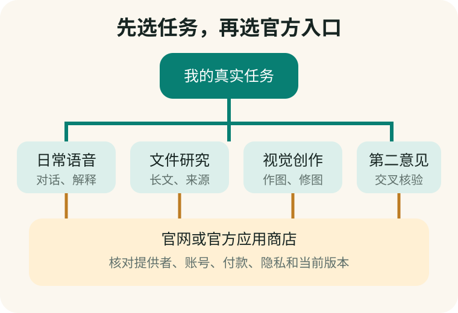

# 第 12 章　中国大陆常用 AI 地图：先找到官方入口

**【回看前文】** 第一册第 1 章已经说明，App、模型、账号、API 和会员不是一回事；第二册第 5 章已经说明，不存在脱离任务的“永远最好”。本章把这些工程知识用于中国大陆普通用户的实际选择。

## 先不要安装十个 App

林老师的手机里曾经有一个“万能 AI 会所”。首页分成聊天、健康、作图、老照片、音乐、写作和助理，看起来像七位专家。销售人员说这是“内部整合版”，一年收费数千元。

后来她发现，很多功能也能在几款官方产品的免费层中完成。真正的问题不是“哪个名字最响”，而是四件事：

1. 入口是不是官方的；
2. 当前任务需要文字、语音、文件、图片还是视频；
3. 免费层是否已经够用；
4. 输入的资料会交给谁处理。

**【这是一个比方】** 选择 AI 产品像选择交通工具：去附近买菜、跨城看病和搬家，需要的工具不同。

**【比方的边界】** 软件会更新、切换后台模型并改变条款，不像一辆买回家后结构固定的自行车。

**【作为用户，这对您意味着什么】** 不必同时熟练六款产品。先选一款日常主力，再选一款用来交叉核验，通常比购买一个不透明的“全能入口”更容易管理。



## 一张有日期的产品地图

下面记录的是 **2026 年 8 月 12 日**可以从官网或中国区应用商店核对到的产品身份和公开功能。它不是能力总排名，价格和功能以后会变。

| 产品 | 可以优先试的任务 | 核对官方身份 | 价格应怎样理解 |
|---|---|---|---|
| DeepSeek | 复杂解释、推理、代码、第二意见 | 官网 `deepseek.com`；App 提供者为杭州深度求索人工智能基础技术研究有限公司 | 官方消费者 App 标为免费；开发者 API 另行按 Token 计费 |
| 豆包 | 语音对话、日常问答、识图、作图和低门槛操作 | 官网 `doubao.com`；中国区 App 提供者为北京春田知韵科技有限公司 | App 免费下载并有应用内购买；具体会员和资源价格在付款页核对 |
| Kimi | 长文件、研究、写作和多步骤任务 | 官网 `kimi.com`；从官网进入下载或会员页 | 有免费档和多档会员；2026-08-12 官方年付折合月价从 39 元起，月付从 49 元起，高档明显更贵 |
| 千问 | 中文综合任务、办公、图片与阿里生态服务 | 中国区 App 名称含“千问—阿里 AI 助手”；提供者为上海智信普惠科技有限公司 | 免费下载并有应用内购买；不要把千问 App、Qwen 模型和云 API 当成同一种商品 |
| 腾讯元宝 | 语音、文件、公众号及腾讯生态内容 | 中国区 App 提供者为腾讯科技（深圳）有限公司 | 基础入口可免费使用；增值项目以当前付款页为准 |
| 文心 | 中文写作、搜索、图片、视频和百度生态 | 官网 `wenxin.baidu.com`；中国区 App 提供者为北京百度网讯科技有限公司 | 免费下载并有应用内购买；部分生成资源按能量或其他额度消耗 |

“可以优先试”只是为减少第一次选择的复杂度。产品页上写“最强”“领先”属于厂商主张；只有用自己的任务、同一材料和同一验收表比较，才能知道它对自己是否合适。

## 普通用户怎样登录才稳妥

建议按下面顺序操作：

1. 在浏览器手动输入官网地址，或从官网跳转到应用商店；
2. 核对 App 全名、提供者、隐私政策主体和官网是否互相对应；
3. 使用自己的手机号或该产品正式支持的本人账号登录；
4. 自己保管验证码，不让销售人员代收；
5. 先使用免费层完成三项真实任务；
6. 只有明确碰到额度、文件大小或特殊功能限制，再从 App 内或官网按月购买；
7. 付款后立即记录订阅周期、续费日期、取消入口和收款主体。

不要购买“共享高级账号”。共享者可能看见聊天，原持有人可以改密码，平台也可能因异常登录限制账号。更重要的是：您无法证明那个界面实际连接什么模型。

## 为什么同一个名字会出现在三个地方

“千问”“DeepSeek”“Kimi”可能同时指模型家族、普通用户 App 和开发者服务。三者关系密切，但不是一张票。

- **消费者 App：** 有界面、账号、文件上传、语音、搜索和会员权益；
- **模型：** 后台负责生成或识别的计算系统；
- **API：** 开发者按规定格式调用模型的接口，通常按使用量计费。

**【这是一个比方】** 品牌名像一家酒店集团的名字；具体酒店、客房类型和旅行社代订是不同层次。

**【比方的边界】** AI 产品可以在一次对话里自动切换模型，也可能同时调用搜索、图片和语音服务，实际链条比订房更复杂。

**【作为用户，这对您意味着什么】** 销售者说“我们使用某某大模型”，只证明可能用了一个供应商，不证明这是官方 App、最新版、独家服务或合理价格。

## 建立“一主一副”的两周试用

选择一款日常主力和一款第二意见工具，用同样五题测试：

1. 解释一段自己真正看不懂的中文；
2. 做一次十轮外语练习；
3. 摘要一份不含隐私的公开文件，并指出原文页码；
4. 查一项需要日期的公开信息并给出来源；
5. 对一道不知道答案的问题承认不确定，而不是编造。

记录准确性、来源、语音易用性、字体、广告、限制和是否需要付费。两周后再决定是否保留。不要只比较第一次回答是否“惊艳”。

## 手机实验：给一个 AI App 做官方身份检查

打开一款已经安装的 AI App，完成这张卡：

```text
App 完整名称：
应用商店提供者：
官网域名：
隐私政策主体：
登录账号归谁：
付款收款方：
当前订阅周期：
自动续费取消入口：
模型名称是否披露：
我用它完成的三个真实任务：
```

如果提供者、官网、付款主体和销售者说法对不上，先停止上传和付款。

## 本章小结

1. **先选官方入口，再比较能力。**
2. **先用免费层做真实任务，不因按钮多而购买不透明“全能助手”。**
3. **App、模型和 API 是三个层次；同一个品牌名不能证明它们完全相同。**
4. **普通用户先建立“一主一副”，一款日常使用，一款用于第二意见。**
5. **动态价格和功能必须看日期、付款页和提供者，不能记成永久事实。**

