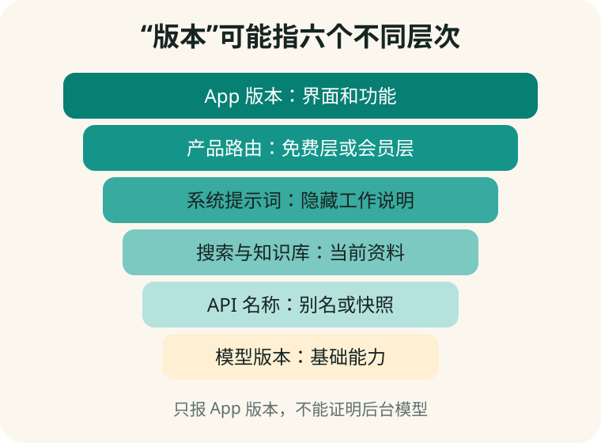

# 第 13 章　模型、版本与更新：为什么界面没变，能力已经变了

**【回看前文】** [第 12 章](#chapter-12)已经区分官方 App、模型和 API。本章继续拆开“版本”这个词。

## “我用的是最新版”可能少说了五件事

林老师问销售人员：“这是不是最新版 ChatGPT？”对方回答：“当然，是 6.8.2 版。”后来她才知道，6.8.2 只是那个套壳 App 的版本号，不能证明后台使用哪一个模型。

一次 AI 服务可能同时有六种变化：

| 层次 | 例子 | 用户真正要问什么 |
|---|---|---|
| App 版本 | 6.8.2 | 只是界面修复，还是能力改变？ |
| 后台模型版本 | V4、K3 等 | 当前回答实际由哪个模型生成？ |
| API 模型名 | 一个字符串名称 | 名称固定指向一个快照，还是会自动升级？ |
| 系统提示词 | 隐藏工作说明 | 商家是否改变了语气、推荐规则或限制？ |
| 搜索和知识库 | 实时网页、内部文件 | 来源何时更新，谁选择这些资料？ |
| 安全和路由规则 | 免费层、会员层分流 | 哪些请求会换成便宜或较小模型？ |



## 固定快照和移动别名

开发者有时使用带日期或代号的**固定快照（snapshot）**，尽量让同一名称长期对应同一模型；也可能使用会自动指向新模型的**别名（alias）**。

**【这是一个比方】** 固定快照像购买某年某版字典；移动别名像订阅一个持续换新版内容的在线词典。

**【比方的边界】** 即使模型快照固定，服务器、搜索结果、安全过滤和第三方工具仍可能变化，不能保证每次输出逐字相同。

**【作为用户，这对您意味着什么】** 如果是普通聊天，自动更新通常方便；如果是合同检查、研究或长期重复流程，应记录日期、产品、模型名和关键设置，并保留输入输出样本。

## 模型一般多久更新一次

没有行业统一周期，也没有“每三个月一定换代”的规则。更新可能隔几天、几个月或更久，厂商也可能只更新 App 功能而不训练新基础模型。

以 DeepSeek 官方 API 更新日志为例，2024—2026 年间既出现相隔数周的小更新，也出现跨数月的大版本，并发生过旧 API 名称停止使用。这个例子只说明更新节奏不固定，不能外推为其他厂商也会按相同时间表更新。

对普通用户，更实用的做法是：

- 每月查看一次常用产品的更新说明即可；
- 做重要任务当天记录实际模型和日期；
- 不因“刚更新”就假定所有能力都更好；
- 旧提示词在新版本上重新做五题测试。

## 为什么骗子或第三方还能提供“旧版 ChatGPT”

常见工程路径有四种：

1. 通过仍可使用的旧 API 模型或兼容接口调用；
2. 自己保存并运行开放权重的旧模型，再用相似名称宣传；
3. 使用其他公司的便宜模型，却在界面写“ChatGPT”；
4. 只保留旧界面、旧系统提示词或旧回答缓存，让用户误以为模型版本很旧。

因此，“回答感觉像旧版”不能证明来源。“能回答 ChatGPT 风格的问题”也不能证明是 OpenAI 官方服务。

根据 2026 年 8 月 12 日的 OpenAI 官方 API 模型目录，一些旧模型仍被列为旧版或已弃用，官方目录同时明确区分当前模型、旧模型和已弃用模型。第三方能够调用某个兼容模型，不等于它有权把自己的产品称为官方 ChatGPT。

## 旧模型有什么利弊

旧模型不一定毫无价值：

**可能的好处：**

- 成本较低；
- 速度较快；
- 对一个已经测试稳定的简单流程，变化较少；
- 本地旧模型在断网环境中仍可完成有限任务。

**明显的限制：**

- 对新事件和新规定更不了解；
- 推理、中文、长文件或多模态能力可能较弱；
- 可能缺少新的安全修复和工具支持；
- API 可能被停用，产品突然不能使用；
- 销售者容易利用用户不懂版本，把低成本服务按高价出售。

**【这是一个比方】** 旧模型像一台还能打字的旧电脑：写一封短信可能够用，但不能因为还能开机就按最新专业工作站的价格出售。

**【比方的边界】** 模型能力不是只由年代决定。有些旧模型在特定任务上仍可能比某些新小模型合适，必须用任务测试。

## 怎样要求商家证明版本

付款前可以要求对方书面回答：

```text
1. 产品经营主体和官方网站是什么？
2. 底层模型由哪家公司提供？准确模型标识是什么？
3. 这是固定版本还是会自动路由？
4. 免费用户和付费用户是否使用不同模型？
5. 模型、搜索、知识库和 App 最近一次分别何时更新？
6. 如果模型停用，我的数据、余额和退款怎样处理？
```

如果回答只有“满血版”“内部版”“军方版”“无限制版”，没有模型标识、条款和经营主体，就还没有提供证据。

## 手机实验：做一张版本记录卡

在一次重要任务结束后，保存：

- 产品名称和官网；
- App 版本；
- 页面显示的模型名；
- 日期；
- 是否联网搜索；
- 上传了哪些文件；
- 关键回答和来源；
- 自己怎样验收。

一个月后用同样问题重测。结果改变时，先查版本、搜索来源和设置，不要立刻断定“AI 变笨了”或“被人控制了”。

## 本章小结

1. **App 版本不等于模型版本。**
2. **模型、API 名、提示词、搜索、知识库和路由可以分别更新。**
3. **没有统一更新周期；重要的是记录日期并重测自己的任务。**
4. **第三方能调用旧模型，不等于它是官方产品或值得高价。**
5. **旧模型可以便宜、快速和稳定，也可能过时、能力较弱并面临停用。**

