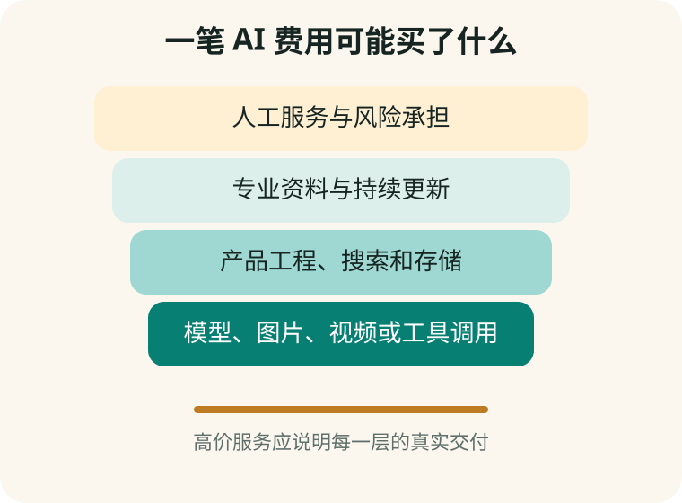

# 第 14 章　一段 AI 对话到底值多少钱

**【回看前文】** 第一册已经解释 API 是软件之间的接口，[第 12 章](#chapter-12)区分了消费者会员和开发者 API。本章用成本结构判断价格，而不是把“收费”一概当作骗局。

## 免费不等于没有成本，收费也不等于合理

运行模型需要计算设备、网络、存储和维护。厂商可以用补贴提供免费层，第三方也可以对界面、搜索、客服和行业资料收费。

真正需要判断的是：收费方提供了什么额外价值，是否如实披露，价格和风险由谁承担。

## Token 是怎样计费的

许多文字 API 按输入和输出的 **Token（文字片段）**计费。输入不只包含这一句话，还可能包括系统提示词、对话历史、检索资料和文件片段。

计算方式可以简化为：

```text
输入费用 = 输入 Token ÷ 1,000,000 × 输入单价
输出费用 = 输出 Token ÷ 1,000,000 × 输出单价
总费用 = 输入费用 + 输出费用 + 搜索、图片或工具费用
```

2026 年 8 月 12 日，DeepSeek 官方 API 价格页列出的 V4 Flash 缓存未命中输入为每百万 Token 1 元，输出为 2 元；V4 Pro 分别为 3 元和 6 元。若一次短对话输入 1,000 Token、输出 500 Token，纯模型文字调用约为：

- Flash：0.002 元；
- Pro：0.006 元。

这不是消费者 App 应收价格。它只说明纯文字推理可能很便宜。产品还可能承担搜索、图片、服务器、开发、客服、支付和税费。

## 图片、声音、视频和智能体为什么更贵

同样点一次按钮，后台工作量可能完全不同：

- 短文字：一次模型生成；
- 长文件：读取大量 Token，还可能建立索引；
- 联网研究：多次搜索、打开网页并反复生成；
- 图片：运行图片模型并保存较大文件；
- 视频：连续生成许多画面和声音；
- 智能体：多轮计划、使用浏览器、代码和云端运行环境。

所以“问一次多少钱”少了任务类型、长度、模型和工具四个条件。

## 一个套壳 App 的价格由哪些层组成



| 价格层 | 可能是真实价值 | 需要的证据 |
|---|---|---|
| 模型调用 | 文字、图像、语音或视频生成 | 模型来源、用量和限制 |
| 产品工程 | 好用界面、文件管理、搜索和工作流 | 实际可测试功能 |
| 专业资料 | 经授权、持续更新的知识库 | 来源、更新时间和引用 |
| 人工服务 | 培训、客服、编辑或专业复核 | 人员身份、范围和交付物 |
| 风险承担 | 合同、售后、安全和退款 | 经营主体与明确条款 |

如果商家只有八个按钮和几段系统提示词，却宣称“每个专家都训练了数亿元”，就需要更强证据。

## 会员、API、课程和人工服务不能混算

以 Kimi 官方页面为例，2026 年 8 月 12 日既有免费档，也有多档会员，年付折合月价和月付价格不同；开发者 API 又按 Token 计费。购买会员不等于取得 API 余额，购买课程也不等于取得会员。

付款页面必须写清：

- 买的是哪个账号的什么权益；
- 按月、按年还是一次性；
- 有无自动续费；
- 额度何时清零；
- 图片、视频和智能体是否另扣额度；
- 退款和取消从哪里操作。

## 判断高价是否合理的五问

1. **可替代性：** 官方免费产品能否完成同一任务？
2. **透明度：** 是否披露经营主体、模型、数据和限制？
3. **附加价值：** 有没有真实资料、人工服务、售后或工作流？
4. **可验收性：** 付款后能得到什么具体成果？
5. **退出成本：** 账号、文件和余额能否带走，能否取消续费？

**【这是一个比方】** 一杯咖啡的豆子成本不等于咖啡店售价，场地、人工和服务都有价值。

**【比方的边界】** 软件可以复制给许多人，边际成本可能很低；更重要的是数据控制、持续服务和虚假宣传风险，不能只按原料加价率判断。

**【作为用户，这对您意味着什么】** 不需要因为 API 成本低就否定所有软件收费，但对数千元套餐应要求可核验的额外价值，而不是接受“AI 很高级”作为解释。

## 常见的付款陷阱

- 1 元或 7 天试用后自动转年费；
- 销售者代注册并掌握账号；
- 先卖“永久会员”，后续再收模型升级费；
- 声称免费额度即将消失，制造紧迫感；
- 用“健康顾问”回答制造焦虑，再卖唯一商品；
- 把应用商店中免费的官方 App 重新包装成昂贵安装服务；
- 只展示总价，不说明图片、视频和智能体额度极少。

## 付款前的可复制提示词

可以把销售页面文字交给另一款 AI 做初筛，但最终要自己打开条款：

```text
请把这份销售说明拆成：服务主体、模型来源、账号归属、
付款周期、自动续费、额度、退款、隐私、具体交付物。
只依据我提供的材料；缺失处写【未披露】。
再列出五个付款前必须向商家书面确认的问题。
不要判断它一定合法或一定诈骗。
```

## 手机实验：算一次真实需求的总价

选一个任务，例如每月写四篇家庭文章、修十张照片或整理两份文件。分别记录：

1. 官方免费层能完成多少；
2. 官方会员最低需要多少钱；
3. 第三方套餐多少钱；
4. 第三方多提供了什么；
5. 谁掌握账号和文件；
6. 三个月不用时能否取消。

只有把任务、期限和退出成本写出来，价格才有可比性。

## 本章小结

1. **免费服务仍有成本，收费服务也必须解释价值。**
2. **Token 费用只是模型调用的一层，不等于完整产品价格。**
3. **图片、视频、长文件和智能体通常会增加计算或工具成本。**
4. **会员、API、课程和人工服务是不同商品。**
5. **高价服务应提供透明主体、可验收交付、数据说明和退出路径。**

