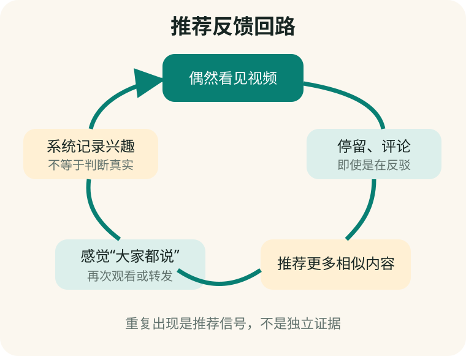

# 第 16 章　为什么您和朋友刷到的“事实”都很相似

**【回看前文】** 第一册已经解释算法是按目标处理信息的步骤。本章讨论的是**推荐算法（recommendation algorithm）**，不是语言模型本身。

## 推荐系统首先在回答“给您看什么”

短视频平台拥有大量内容，不可能同时展示。推荐系统会根据观看时长、停留、点赞、评论、转发、搜索、关注和相似用户行为，对内容排序。

这些信号通常说明“您可能继续看”，并不说明“内容已经证实”。一条夸张健康视频能让人停下来争论，也可能因此获得更多互动。



**【这是一个比方】** 推荐系统像一位不断观察顾客停在哪个货架前的店员，下一次把相似商品摆得更近。

**【比方的边界】** 推荐系统会综合许多信号、平台规则和人工治理，不是一个店员凭直觉决定；不同平台也不完全相同。

**【作为用户，这对您意味着什么】** 连续出现十条相似视频只能证明系统判断您可能愿意看，不能证明十个独立专家都得出同一结论。

## 个人反馈回路怎样形成

一个常见过程是：

1. 偶然看到“某食物治百病”；
2. 因惊讶而看完，还打开评论；
3. 系统记录了较强兴趣信号；
4. 更多相似内容出现；
5. 用户觉得“最近大家都在说”；
6. 再次观看和转发，信号继续增强。

这不意味着平台必然认同视频内容，而是“注意力”被系统误当成或同时当成“兴趣”。

## 为什么朋友也看见同样信息

朋友并不是完全独立的样本。可能因为：

- 年龄、地区、关注账号和兴趣相似；
- 在同一个微信群或朋友圈接触同一来源；
- 互相转发后形成社交传播；
- 多个账号搬运同一段脚本；
- 不同视频最终引用同一家商家或同一篇文章。

**回声室（echo chamber）**指同一群体中相似看法不断互相重复，反对信息较少进入或容易被排斥。

**【这是一个比方】** 它像在有回音的房间里说一句话，听到许多次重复，却仍然来自最初的声音。

**【比方的边界】** 现实社交网络里有许多人和来源，不是封闭房间；用户也会主动选择、质疑或离开。

## “信息茧房”不是一个简单定律

个性化推荐可能缩窄某些人的内容范围，但研究方法、平台和主题不同，结果并不完全一致。不能把所有错误信息都归因于算法；人的选择性接触、朋友关系、商业投放和现实环境也共同作用。

中国现行算法推荐规则要求平台提供不针对个人特征的选项或便捷关闭方式，并允许用户选择或删除用于推荐的个人标签。2025 年网信部门公布的治理进展也提到兴趣管理、“一键破茧”和内容多样性功能，同时承认实际效果仍有改进空间。

## 打破回路不是只点一次“不感兴趣”

可以执行七天信息饮食实验：

### 第一天：停止给可疑内容强互动

不要为了骂它而看完、反复评论或转发。需要保存证据时截图并记录账号、日期和链接。

### 第二天：整理关注列表

取消长期制造恐惧、承诺神效或只导向商品的账号。

### 第三天：管理推荐设置

查找“个性化推荐”“兴趣管理”“用户标签”“不感兴趣”和“内容偏好”。不同 App 名称会变化。

### 第四天：主动搜索不同类型的可靠来源

例如政府部门、大学、医院、专业协会和原始文件。不要只搜索支持自己看法的关键词。

### 第五天：建立反方问题

对一个结论搜索“证据不足”“不适用人群”“副作用”“原始研究”和“监管提示”。

### 第六天：与朋友交换来源，不只交换结论

问：“这条信息最早从哪里来？有没有原文？”

### 第七天：比较首页变化

记录内容主题是否更多样。一次实验不能证明算法内部机制，但能让自己恢复主动选择。

## AI 怎样帮助，又怎样添乱

AI 可以把视频中的主张拆成可核验句子，也可以帮助寻找反面关键词。但如果 AI 使用同一批网络内容，仍可能重复错误。

可复制提示词：

```text
下面是一段短视频口播。请不要判断真假，先完成三件事：
1. 拆出所有可核验事实主张；
2. 标出情绪词、权威暗示、销量或疗效承诺；
3. 为每个主张提出一个寻找反证或适用边界的搜索问题。
```

## 本章小结

1. **推荐目标常与停留和互动有关，不等于事实核验。**
2. **反复刷到相似内容是推荐信号，不是独立证据数量。**
3. **朋友之间可能共享来源、画像和社交网络，也不是完全独立样本。**
4. **信息茧房由算法、个人选择、商业传播和朋友网络共同形成，不能简单归因。**
5. **减少强互动、管理标签、主动引入不同来源并寻找反例，才能逐步打破回路。**

