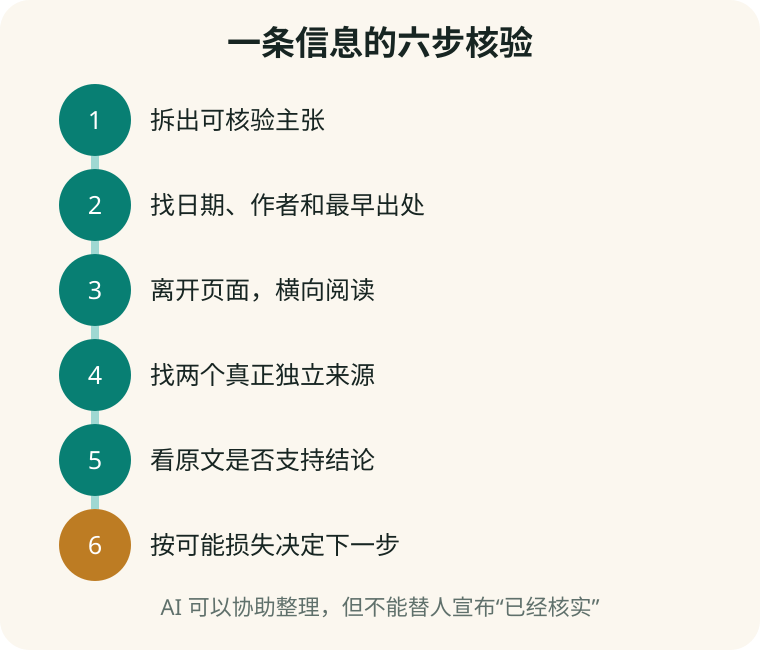

# 第 17 章　一条信息的六步核验法

**【回看前文】** [第 15 章](#chapter-15)解释 AI 错误从哪里来，[第 16 章](#chapter-16)解释相似信息为什么会反复出现。本章给出一套能在手机上执行的流程。

## 第一步：把主张从情绪和意见中拆出来

短视频说：“震惊！老专家终于公开，睡前喝这种粉，三天清血管，医院不愿告诉你。”

可以拆成：

- 有一位可识别的专家；
- 他公开推荐这种粉；
- 三天能产生某种可测量效果；
- 医院普遍隐瞒该信息。

“震惊”“终于公开”是情绪包装，不是证据。“我喝后舒服”是个人经历，不自动证明一般疗效。

## 第二步：找日期、作者和最早出处

查看谁发布、何时发布、是否剪辑、原视频在哪里。旧新闻换标题、外地事件改成本地、论文摘要被二次转述，都会改变意义。

这叫**来源追溯（source tracing）**。

**【这是一个比方】** 来源追溯像查看一张复印件是从哪份原件复印出来的。

**【比方的边界】** 数字内容可以被剪辑、合成和反复转载，最早找到的网页也未必是真正原始证据。

## 第三步：离开当前页面，横向阅读

不要只在发布者自己的主页里找“自我证明”。打开新标签页，搜索机构、作者和关键主张，看其他独立来源怎样评价。这叫**横向阅读（lateral reading）**。

研究中，专业事实核查人员常迅速离开陌生网站，先调查网站和组织背景，而不是被页面设计和一长串引用留住。

## 第四步：寻找两个真正独立的来源

十个账号转载同一篇文章仍然只有一个来源。两个独立来源应尽量拥有不同的原始取证或责任链。

| 主张 | 更合适的来源 |
|---|---|
| 法律条文 | 正式法规全文、政府或法院网站 |
| 药品批准与说明 | 药监部门、正式说明书、医疗机构 |
| 医学效果 | 系统综述、指南、原始研究及专业复核 |
| 公司价格 | 官方价格页和实际付款页 |
| 天气与交通 | 对应官方机构和运营单位 |
| 新闻现场 | 多家有独立采访或原始文件的媒体 |

## 第五步：检查来源是否真的支持结论

一篇研究可能只在小鼠、细胞或少量特定患者中进行。视频却把它改成“所有人都有效”。需要检查：

- 研究对象是谁；
- 比较了什么；
- 结果有多大；
- 观察了多久；
- 有什么限制；
- 结论是否被标题夸大。

“附有论文链接”不是终点。链接必须真的支持所说结论。

## 第六步：按可能损失决定核验强度

| 可能后果 | 建议做法 |
|---|---|
| 低风险：菜谱、措辞、娱乐 | 简单检查即可 |
| 中风险：旅行、购物、公开发布 | 两个来源、日期和条款 |
| 高风险：健康、药品、投资、法律 | 原始权威来源加合格专业人士 |
| 紧急风险：胸痛、呼吸困难、转账威胁 | 不继续和 AI 辩论，立即联系急救、警方、银行或专业机构 |



## AI 在核验中最适合做什么

AI 很适合：

- 把长视频拆成具体主张；
- 提出反证关键词；
- 比较两份已经取得的原文；
- 找出结论中缺失的条件；
- 把专业术语解释成普通中文。

AI 不应独自决定：

- 来源是否真实存在；
- 医疗诊断和用药；
- 是否转账或投资；
- 某人是否违法；
- 一张图片是不是绝对真实。

## 图片、录音和视频也要追来源

肉眼觉得自然不能证明真实，AI 检测器说“90% 生成”也不能单独定案。压缩、剪辑和再次上传会影响检测；水印和来源元数据也可能缺失或被破坏。

更稳妥的是组合检查：原始发布者、最早版本、拍摄时间地点、其他角度、官方通报、文件元数据以及内容标识。技术检测只是其中一项线索。

## 完整例子：核验“某粉三天清血管”

1. 拆成疗效、时间、专家身份和医院隐瞒四项主张；
2. 反向寻找原视频和商品主体；
3. 离开销售页面，查国家卫健委、药监信息和医疗指南；
4. 检查所谓论文是否为人体研究；
5. 看研究是否真的测量血管结果，还是只测某个实验指标；
6. 因为停药或替代治疗后果严重，带着材料咨询医生，不自行试用。

## 可复制的核验提示词

```text
请协助我核验下面的主张，但不要直接宣布真假。
先拆成最小事实句；列出每句需要的原始证据；
区分原始来源、转载、商家材料和个人经验；
检查引用是否支持结论，并列出适用范围、反例和缺失信息。
最后按低、中、高风险建议下一步人工核验方式。
```

## 本章小结

1. **先拆主张，再查来源；不要核验一团情绪。**
2. **离开当前页面做横向阅读，调查发布者和出处。**
3. **多次转载不是多个独立来源。**
4. **打开原文，检查研究对象、方法、结果和限制是否支持标题。**
5. **核验强度应与可能损失相匹配。**
6. **AI 可以整理核验任务，不能替人宣布事实已经核实。**

