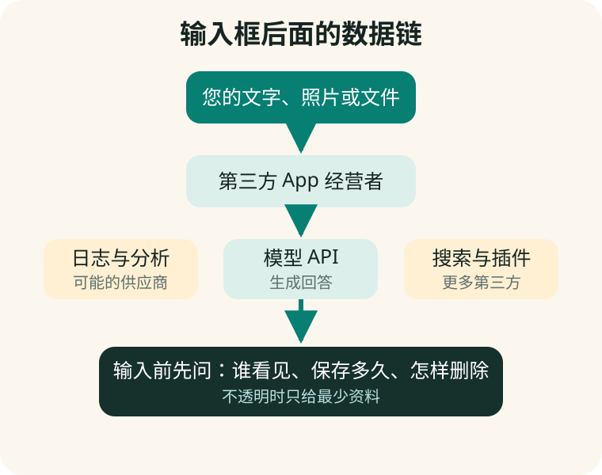

# 第 19 章　输入框也是数据出口

**【回看前文】** 第一册第 1 章解释了服务器和第三方 App，第三册第 6 章说明“新开对话不等于删除”，第四册第 11 章解释 API 密钥。本章把这些知识合成一套输入前检查。

## 一段话可能经过不止一家公司

在官方产品里输入问题，通常由该产品及其供应链处理。在第三方套壳 App 中，数据还可能经过：

```text
手机输入法
  ↓
第三方 App 经营者
  ↓
日志、分析或广告服务
  ↓
一个或多个模型 API
  ↓
搜索、文件解析或插件服务
```

链条不透明时，用户不知道谁保存了提示词、附件、设备标识和付款信息。



## 个人信息不只是身份证号

姓名、照片、声音、电话号码、住址、行程和家庭关系可以组合识别一个人。病历、金融账户、生物识别和不满十四周岁未成年人的信息在中国《个人信息保护法》中属于敏感个人信息或受到更严格保护。

**数据最小化（data minimization）**是只提供完成任务真正需要的最少资料。

**【这是一个比方】** 请人修改一封信，不需要把整个家庭档案柜的钥匙都交给他。

**【比方的边界】** 数字资料可以被复制、记录和关联，交出后不像实体钥匙那样一定能全部收回。

**【作为用户，这对您意味着什么】** 上传前先删除姓名、证件号、精确地址、账号、签名和无关页面；能用虚构示例解决的，就不要用真实隐私。

## 用红黄绿三色判断输入

### 绿色：一般可输入

- 自己写的公开文字；
- 已公开且不含隐私的网页；
- 虚构练习材料；
- 不涉及账号和身份的普通问题。

### 黄色：匿名化后再输入

- 投诉信草稿；
- 家庭故事；
- 工作文件片段；
- 行程和订单；
- 含他人姓名的会议记录。

### 红色：默认不输入不透明服务

- 验证码、密码和 API 密钥；
- 身份证、银行卡和完整金融流水；
- 完整病历和未脱敏检查报告；
- 私密照片、儿童资料和他人录音；
- 公司秘密、客户名单和未公开合同；
- 能直接控制设备的远程权限。

## “本地”“私有”和“加密”要分别证明

- **本地运行：** 核心计算是否真的在设备上完成；
- **私有：** 谁能访问，是否用于其他目的；
- **加密：** 传输和存储是否有保护；
- **不训练：** 不用于训练不等于完全不保存；
- **已删除：** 从哪个界面删除，备份和法定留存怎样处理。

任何一个词都不能替代完整数据说明。

## 共享账号为什么会带来经济和隐私损失

购买共享账号可能导致：

- 其他使用者看到历史对话和附件；
- 销售者重置密码并收回账号；
- 多地登录触发限制，已付款权益消失；
- 银行卡或续费绑定在错误账号；
- 无法请求导出或删除自己的数据；
- 对方利用保存的个人情况继续精准推销。

账号应该属于实际用户本人，并开启产品提供的多因素认证（Multi-Factor Authentication, MFA）。MFA 是在密码之外再验证一次身份，例如验证码或认证器。

**【这是一个比方】** 密码像门钥匙，MFA 像进门后还要出示只有本人持有的证件。

**【比方的边界】** 短信也可能被诈骗者套取，任何认证方式都不能抵消主动把验证码告诉他人的风险。

## 新开对话、删除对话和删除账号不是一回事

- **新开对话：** 主要改变新回答看到的当前上下文；
- **删除对话：** 请求产品删除某个聊天及附件，实际范围看政策；
- **清除记忆：** 删除产品长期保存的个人偏好或事实；
- **关闭训练或改进：** 控制资料是否进入某些改进流程；
- **注销账号：** 结束账号关系，仍需查看余额、导出和留存规则。

只按“新对话”不会自动处理旧聊天、附件、记忆或后台留存。

## 上传文件前做一个副本

1. 保留未修改原件；
2. 制作专门上传的副本；
3. 删除无关页和隐藏批注；
4. 用“甲方”“医院 A”等代称；
5. 检查图片中的人脸、二维码和定位；
6. 记录上传到哪个产品、哪个账号、哪一天；
7. 用完后按产品说明删除聊天、附件和记忆。

## 已经泄露时怎么办

- 密码：立即改密码，并检查其他网站是否重复使用；
- 验证码：联系对应服务并检查登录记录；
- API 密钥：在官方平台撤销并重建，查看费用；
- 银行和证券资料：联系机构冻结或监控；
- 私密文件：保存证据，联系平台和有关机构；
- 套壳 App：停止输入，取消授权和续费，保留订单与聊天记录。

不要只删除手机上的 App 图标。那不会自动删除服务器数据或取消订阅。

## 手机实验：做一次数据出口盘点

选择最常用的两款 AI，记录：

```text
账号属于谁：
登录方式：
是否开启 MFA：
上传过哪些文件：
是否有记忆：
删除对话入口：
关闭改进或训练入口：
导出数据入口：
注销账号入口：
自动续费在哪里取消：
```

找不到的项目写“未找到”，不要让 AI 猜按钮位置；打开当前帮助页或联系客服。

## 本章小结

1. **第三方 AI 的输入可能经过多家公司和工具。**
2. **只提供完成任务所需的最少数据，敏感资料默认不进不透明服务。**
3. **本地、私有、加密、不训练和删除是不同承诺。**
4. **共享账号会造成聊天暴露、权益丢失和持续推销风险。**
5. **新开对话不等于删除；删除聊天、记忆、附件和账号也要分别处理。**
6. **泄露密码、验证码或密钥后要撤销和止损，不只是删聊天。**

