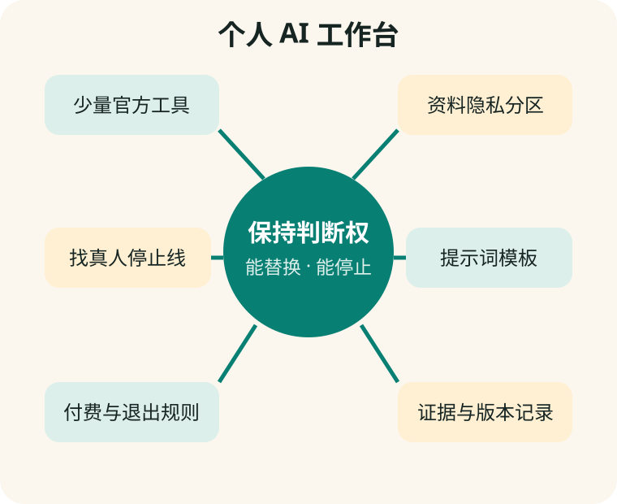

# 第 20 章　建立自己的 AI 工作台

**【回看前文】** 前十九章分别讲了工程、提示词、创作、产品、信息和隐私。本章不是再推荐一个“万能 App”，而是把已经学会的方法组成个人制度。

## 工作台是一套方法，不一定是一套新软件

林老师最后没有再买“八合一专家”。她保留两款官方 AI、一个浏览器书签文件夹、一个提示词笔记和一个只在电脑里的家庭资料目录。

**个人 AI 工作台（personal AI workbench）**是自己能看懂、能替换、能停止的一组工具和规则。

**【这是一个比方】** 它像一张整理好的书桌：常用工具在手边，重要原件锁好，每件东西有固定位置。

**【比方的边界】** 数字工具会联网、更新和复制数据；整齐文件夹本身不能保证隐私和事实正确。

**【作为用户，这对您意味着什么】** 真正的独立不是拥有最多 App，而是知道每个工具负责什么、资料去了哪里、什么时候必须换成人。



## 第一部分：只保留角色清楚的工具

建议从四类中各选零到一款：

| 角色 | 用途 | 选择标准 |
|---|---|---|
| 日常助手 | 对话、解释、语音 | 官方身份、易用、免费层够用 |
| 第二意见 | 重要问题交叉检查 | 与主力不同产品，并能显示来源 |
| 创作工具 | 图片、视频或修图 | 原件保护、授权、导出和标识 |
| 本地工具 | 私人文件或离线网页 | 断网可用、权限清楚、有人维护 |

同一产品能承担多项角色时，不必重复安装。

## 第二部分：建立资料分区

电脑或云盘中可以建立：

```text
AI工作台/
  01-公开资料/
  02-可匿名化副本/
  03-禁止上传原件/
  04-提示词模板/
  05-核验记录/
  06-付款与账号/
```

“禁止上传原件”只保存重要照片、病历、证件和合同原件；需要 AI 处理时，从原件制作删减副本。

## 第三部分：保存能复用的提示词，不保存神秘咒语

建立四个模板：

### 学习模板

> 先判断我的水平，一次问一个问题；先给提示，不立即给答案；每轮只纠正一个主要问题；最后让我不用看答案复述。

### 写作模板

> 先采访、再整理事实、再给提纲；缺少信息写【待确认】；不要编造经历和引用；修改时列出改动。

### 核验模板

> 拆分事实主张，找原始来源和日期，区分材料支持、推断与待核验，并寻找反例。

### 隐私模板

> 在处理前列出需要哪些资料、为什么需要、是否可以匿名化；不要索取密码、验证码、密钥和无关个人信息。

## 第四部分：建立“先小后大”的付费规则

自己的规则可以写成：

1. 先免费试两周；
2. 第一次只按月，不买永久或高价年包；
3. 只在官网或官方 App 内付款；
4. 付款当天记录取消日期；
5. 超过自己设定的金额，与一位不从交易中获利的人讨论；
6. 不为共享账号、代收验证码和无法书面说明的“内部版”付款。

## 第五部分：每项重要任务保留证据链

重要输出旁保存：

- 原始问题和材料；
- 产品、模型和日期；
- AI 草稿；
- 打开的来源；
- 人工修改记录；
- 最终决定者。

这不是为了把生活变成审计，而是让健康、投诉、公开文章和家庭档案能够回看。

## 第六部分：设定“必须找真人”的停止线

提前写清楚：

- 医疗诊断、处方变化和急症找医生；
- 投资转账和账户异常找银行、券商或监管渠道；
- 重要法律期限和诉讼找合格专业人士；
- 账号被盗和诈骗威胁联系平台、银行或警方；
- 陌生命令会删除文件或要求管理员权限时找懂技术的人。

停止线要在平静时决定，不能等销售者制造紧迫感以后再想。

## 一个月维护一次

每月用二十分钟：

1. 删除不用的 App 和权限；
2. 检查订阅和自动续费；
3. 查看常用产品更新；
4. 清理不需要的对话、附件和记忆；
5. 备份照片和重要文件；
6. 用一项固定任务重测主力 AI；
7. 更新官方信息与辟谣书签。

模型公司可能频繁更新，但普通用户不需要每天追新闻。一份稳定的月度检查比不断换工具更有用。

## 怎样与家人或朋友共同学习

不要用“你被骗是因为你不懂”开始。可以一起完成三个具体练习：

- 对同一 App 查提供者和付款主体；
- 把一条短视频拆成可核验主张；
- 把一个真实需求写成五部分提示词。

目标不是让家人替用户控制账号，而是让用户自己能解释、能操作、能拒绝。

## 毕业练习：完成一个真实项目

选择“家庭纪念网页”或“一个月外语学习计划”：

1. 说明目标和不做什么；
2. 选择工具并说明理由；
3. 给资料分隐私等级；
4. 用模板开始多轮对话；
5. 保存版本和来源；
6. 找一位真人试用或检查；
7. 写下下次改进一件事。

如果能说清楚每一步，您已经不是被动点击 AI 的人，而是在管理一套工具。

## 全书结语

AI 模型不是神秘专家，也不是只能远离的危险机器。它是可以通过 App、网页、终端和程序使用的工程系统。真正重要的能力，是看见界面后面的模型、数据、规则、费用和责任。

您不需要记住所有品牌。记住几个问题就够了：

- 我现在在用什么？
- 它为什么这样回答？
- 证据在哪里？
- 我的资料去了哪里？
- 谁从这个建议中获利？
- 如果错了，损失多大，谁来负责？

## 本章小结

1. **个人工作台是一组可理解、可替换、可停止的工具和制度。**
2. **少量官方工具、清楚资料分区和可复用模板比“万能 App”更可靠。**
3. **付款、隐私、核验和找真人都应提前设定规则。**
4. **每月维护一次，不必每天追逐模型新闻。**
5. **最终目标是让用户保持账号、资料、判断和停止权。**

